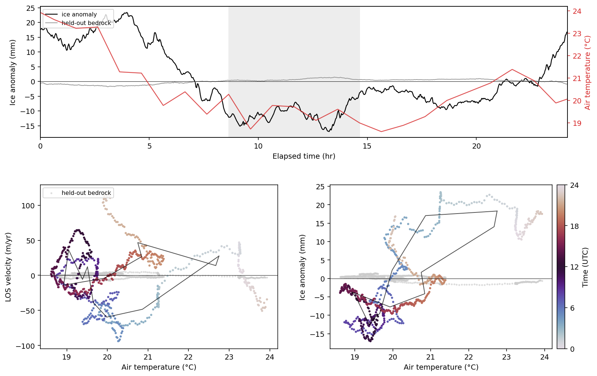
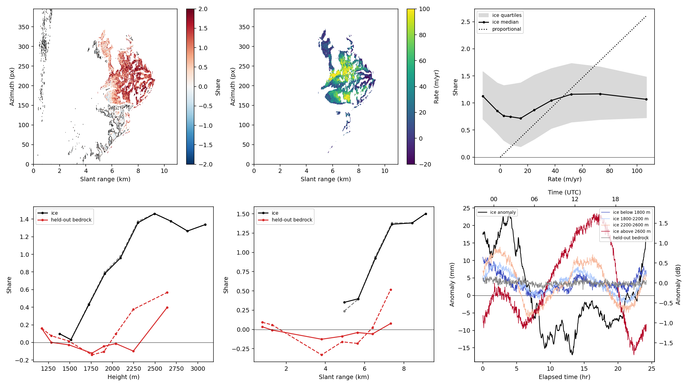
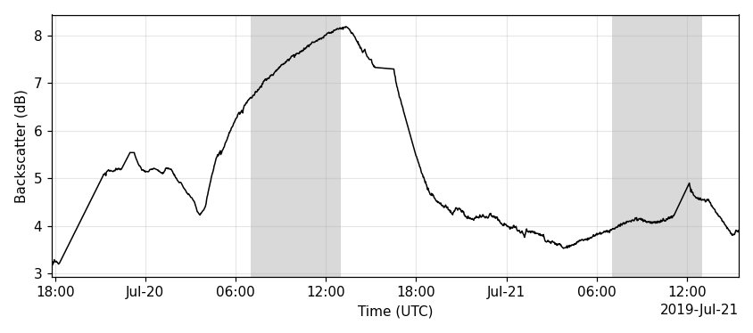
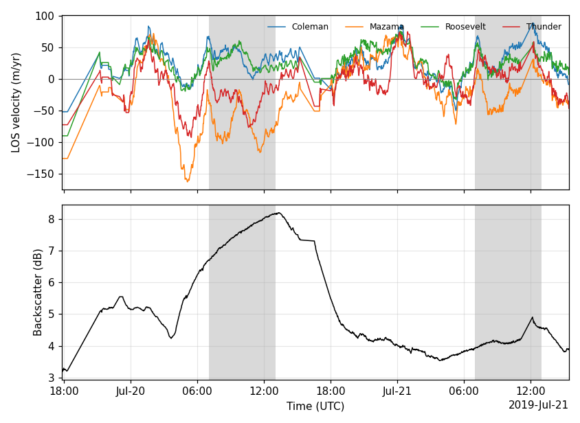

# The Mount Baker campaigns

The worked example for [GPRI_tools](../README.md): eight GPRI-II campaigns on
the north side of Mount Baker, Washington, recorded from the BakerBend1
tripod position between 2016 and 2019 and processed end to end with this
package. Everything below is a result, not a feature — what the tools were
built to answer, and what the answer turned out to be.

The experiment's question is **sub-daily velocity and uplift variation driven
by the subglacial drainage system**: a diurnal signal, if it exists, in
line-of-sight displacement over Coleman and Roosevelt glaciers. The campaign
inventory, scan headings and per-campaign processing notes are in
[`campaigns.md`](campaigns.md); the atmospheric ladder that every number here
rests on is in [`atmosphere.md`](atmosphere.md).

## Diurnal signals — the point of the experiment

The BakerBend1 campaigns were run to catch **sub-daily velocity and uplift
variation driven by water pressure in the subglacial drainage system**.
`20170803` is 723 acquisitions on a 2-minute cadence spanning 24.18 hours: one
complete diurnal cycle, sampled 723 times.

`gpri_tools.diurnal` fits secular rate plus harmonics per pixel and reports amplitude
and the **hour of peak**, which is the diagnostic quantity — it says how long
the bed takes to respond to surface melt. It refuses records shorter than one
cycle outright, because over less than a period the amplitude and the secular
rate are not separable and a number returned there would be meaningless.

The hard part is that **the atmosphere is diurnal too**. Temperature and
humidity on a mountain flank cycle at exactly the period being looked for, and
roughly in phase with it — melt and warming peak together. Before correction
the atmospheric diurnal is one to two orders of magnitude larger than the
glaciological one. So the module ships three tests, and a claim should survive
all three:

1. **`range_dependence`** — the sharp one. Residual refractivity is *linear in
   slant range*; ice motion has no reason to correlate with distance from a
   tripod. A diurnal amplitude that grows with range is atmosphere.
2. **`atmospheric_coherence`** — regress each pixel against the independently
   estimated per-epoch refractivity series.
3. **`stable_ground_null`** — run the same fit on bedrock, which is not moving.
   That amplitude is the error floor; a diurnal on ice below it is not a
   detection.

And before any of that, **reference the series to stable ground**
(`gpri_tools.timeseries.reference_to_stable`). Running the full 722-pair day without
it produced a clean 27.8 mm diurnal on ice — and a 33.0 mm one on bedrock, at
the same phase. An interferogram fixes phase only up to an additive constant,
so integrating the network accumulates 722 arbitrary offsets into a scene-wide
drift that is smooth, coherent, and diurnal. The range-dependence test does not
catch it (r = −0.015) because it is not range-dependent, it is *constant*. Only
the bedrock null caught it. Hold reference pixels out of that null, or the test
is circular.

*What an unreferenced series looks like. Bottom right is the tell: the
bedrock null (red) traces the same curve as the ice (blue), offset by a
constant. Bedrock is not moving. Bottom left shows why the range test misses
it — the artefact is flat in range, not sloped.*

And a geometry limit worth stating before anyone reads uplift off a LOS series:
at a beam elevation of 10°, LOS sensitivity to vertical motion is `sin(10°) =
0.17` against `cos(10°) = 0.98` for horizontal. **A tripod radar is a
horizontal-motion instrument, nearly blind to uplift, and one line of sight
cannot separate the two at all.** `vertical_sensitivity` and `decompose_los`
make that explicit.

## What the 20170803 day actually shows

Running the full 722 pairs, referenced to bedrock (`examples/baker_diurnal.py`):

| | unreferenced | referenced |
|---|---:|---:|
| ice diurnal amplitude (median) | 27.8 mm | **17.9 mm** |
| held-out bedrock null (median) | 33.0 mm | **11.3 mm** |
| bedrock phase concentration | 0.919 | **0.141** |
| variance explained by refractivity | 70.3 % | **41.2 %** |
| amplitude vs slant range | r = −0.015 | r = −0.164 |
| **ice / bedrock ratio** | **0.84** | **1.59** |

Referencing removed a 99.4 mm peak-to-peak common mode and did what it should:
the bedrock phase concentration collapsed from 0.919 (every rock pixel peaking
at the same hour — a systematic error) to 0.141 (incoherent, as unmoving ground
should be), and the peak-hour map went from one uniform colour to real spatial
structure.

**The honest verdict is still negative.** Ice diurnal amplitude is 1.59× the
bedrock error floor — suggestive, but under the 2× bar the script applies, and
41 % of the remaining variance is still explained by the refractivity series
alone. This is not a detection of subglacial hydrology, and the pipeline says
so rather than reporting the 17.9 mm on its own.

That is close enough to the floor to be worth pursuing with better data, which
is the case for the next section.

## The reference audit: coherence is not stationarity

The stable-ground reference was originally chosen by coherence alone — and
slowly moving ice stays coherent at a 2-minute pair spacing. Auditing the
mask against the **Randolph Glacier Inventory** (`gpri_tools.glaciers`,
`examples/baker_rgi.py`) found that **65 % of the coherence-chosen
"bedrock" was on RGI glacier** (14,407 of 22,030 px on 20170803, with the
measured heading) — Coleman, Roosevelt and Mazama surfaces were
in the reference, so every earlier bedrock-referenced product was tied to
moving ground: real motion subtracted from the maps, an artificial signal
pushed onto rock, and a "bedrock null" that was mostly ice.

Correcting the masks (reference = coherent ∧ outside buffered RGI outlines;
ice = RGI-defined) changes the diurnal verdict materially — see the
single-step least-squares numbers below. The overlay is only as good as the
scan heading it is drawn with, and the 105° used through v0.5.0 was a guess:
the terrain itself (["The scan heading is not in the data"](../README.md#the-scan-heading-is-not-in-the-data))
puts 20170803 at 107.4°, and the other campaigns anywhere from 100.1° to
122.8°. The masks are now drawn with each campaign's measured heading.

## Does the pipeline actually recover ice motion?

The sharpest check available, on the corrected 20170803 day — cumulative LOS
displacement after 24.2 h, RGI-defined ice against **held-out** rock (rock the
corrections never saw):

| | pixels | median | mean | p16–p84 |
|---|---:|---:|---:|---:|
| RGI ice | 25,992 | **+90.0 mm** | +104.8 mm | +7 to +208 |
| held-out rock | 3,816 | **−1.2 mm** | +1.4 mm | −27 to +28 |

(`baker_population.py` prints this table for every campaign.) Rock sits at
zero — as unmoving ground must, and it was never used to fit the
corrections — while the ice moves 90 mm toward the radar over the day. The
correlation between ice displacement and slant range is **+0.06**, so this is
not the epoch screens extrapolating a ramp over the ice; it is spatially
organised motion where the inventory says there is a glacier. A day of
~90 mm LOS is the right order for Coleman and Roosevelt flow projected onto a
near-horizontal look direction. The same rows for the other eight scenes are
under ["Eight campaigns on one clock"](#eight-campaigns-on-one-clock).

This is the secular signal, and it is the part the old ice-contaminated
reference was actively destroying. The diurnal remains the harder question
below.

## Single-step least squares, after Ohenhen et al.

`gpri_tools.pairlsq` fits the temporal model — secular rate + diurnal harmonics (+
optional covariates such as the refractivity series) — **directly to the pair
observations** by weighted least squares, in the style of Ohenhen et al.'s
subsidence mapping, with formal per-pixel uncertainties. Three things the
integrate-then-fit pipeline cannot do:

- the pair errors are independent, so this is the correctly *whitened*
  problem (integration turns them into a random walk, and OLS on a random
  walk both loses efficiency and reports optimistic error bars);
- per-pair coherence weights enter naturally — the measured win is ~2× lower
  amplitude error under uneven pair quality;
- every amplitude map comes with a σ map, so "diurnal detection" can mean
  `amplitude > 3σ` per pixel, and held-out bedrock gives the real false-alarm
  rate of the whole chain for free.

The constant cancels in the differencing, so no reference epoch is needed and
disconnected networks still constrain rate and harmonics. And the error bars
say something blunt worth hearing: a short-pair chain sees only `A·ω·Δt` of a
smooth harmonic per pair, so most of the diurnal sensitivity lives in the
longer combinations a daisy chain does not have — the same conclusion the
campaign inventory reached about 20170827 from the other side.
`examples/baker_pairlsq.py` runs the comparison on real data
(`docs/figures/15_pairlsq_20170803.png`). With coherence-only masks the
result was null (ice/bedrock ratio 2.1, 3.6 % of ice above 3σ vs a 1.2 %
false-alarm rate). **With the RGI-corrected masks** (`--rgi`) the picture
sharpens:

| | coherence-only | RGI-corrected |
|---|---:|---:|
| ice median amplitude | 16.1 mm | 17.9 mm |
| held-out bedrock amplitude | 7.7 mm | 7.2 mm |
| ice/bedrock ratio | 2.1 | **2.50** |
| ice above 3σ | 3.6 % | **9.3 %** |
| bedrock false-alarm rate | 1.2 % | **0.8 %** |

The bedrock false-alarm rate falls to ~the value the error bars predict —
the uncertainty model is close to calibrated once the null is on actual rock
— and the ice contrast clears the 2× bar for the first time, at ~10× the
bedrock detection rate. Projecting the refractivity series out inside the
fit does not move the ice amplitude (17.9 → 17.9 mm): what remains on
RGI-defined ice is not refractivity-shaped. Still a population-level
contrast rather than a per-pixel detection (median SNR 1.64), and one cycle
cannot show the signal repeats — that remains 20170827's job.

## Which campaign to use

[`campaigns.md`](campaigns.md) inventories all 25 GPRI campaigns on
cold storage (`bin/survey_campaigns.py` regenerates it), plus two that were
never on those volumes at all. The short version:

| campaign | stage | span | cycles |
|---|---|---:|---:|
| `20190719` | raw → **slc** (`gpri focus`) | **45.7 h** | **1.90** |
| `20170827` | raw → **slc** (`gpri focus`) | **44.9 h** | **1.87** |
| `20180808` | raw → **slc** (`gpri focus`) | **41.4 h** | **1.73** |
| `20170803_full` | raw → slc (`gpri focus`) | 24.2 h | 1.01 |
| `20170803` | diff | 24.1 h | 1.01 |
| `20170713_full` | raw → slc (`gpri focus`) | 23.9 h | 0.996 |
| `20170713` | diff | 21.8 h | 0.91 |
| `20170913` | raw → slc (`gpri focus`) | 14.5 h | 0.61 |
| `20180709` | raw → slc (`gpri focus`) | 6.9 h | 0.29 |
| `20160826_full` | raw → slc (`gpri focus`) | 3.7 h | 0.15 |

**Two of the three two-cycle campaigns came off a backup of the field
computer**, not off the analysis volumes: `20180808`, 1,229 acquisitions from
2018-08-09 00:03 to 08-10 17:25 UTC, and `20190719`, 1,140 acquisitions from
2019-07-19 17:47 to 07-21 15:28 UTC — recorded, as it happens, while that
backup was being made. GAMMA had focused `20180808` out to 12.5 km; both are
refocused here across the full swath so that every campaign is processed the
same way. The same backup settles a negative: there is no GPRI data from late
August or September 2019, whatever the field plan intended.

**`20170827` is the dataset the experiment deserves** — 44.9 hours, 1335
acquisitions at 2-minute cadence, nearly two full cycles, and an *i*→*i*+3
network that actually has closure. It was left as 582 GB of raw sweeps;
`gpri focus` turns those into SLCs for both antennas (about 90 minutes,
I/O-bound). Two things about it to know before using it: the scan was widened
from −30..50° to −30..60° after the first 197 acquisitions, so the SLCs come
in two lengths (396 and 446 lines — `SlcPairStack` crops every pair to the
common leading block, which starts at the same azimuth), and there are two
gaps in the cadence, 19 minutes at that geometry change and 8 minutes a day
later.

`20170803` — one cycle, processed by GAMMA — remains the default scene, and
`20170803_full` is that same day refocused from its 723 raw acquisitions. The
refocus was not about the SLCs: it is that `bin/run_scene.sh` skips both
geometry steps for a scene that ships a GAMMA `diff0`, so the GAMMA scene
alone had no azimuth-offset sidecar and a heading measured from two SLCs
instead of eight. Refocused, co-registered and re-headed, the day gives
+30.95 m/yr on ice against +31.2 from GAMMA's own SLCs, and +24.29 against
+24.5 by the linear fit — 0.3 m/yr apart, which is the closest thing to an
end-to-end validation of `gpri focus` this archive can offer.

`20170713` as GAMMA shipped it stops at 21.8 h, and the harmonic fits refuse
it — over 0.91 of a cycle amplitude and rate are not separable. Its raw
archive runs to 23.9 h (271 acquisitions at 5-minute cadence), five minutes
short of a day, and `gpri focus` writes that as the `20170713_full` scene.
The fits accept it: `MIN_CYCLES = 0.98` in `gpri_tools.diurnal`, because the
rate/harmonic correlation has no cliff at exactly one period (0.78 at 1.00
cycles, 0.80 at 0.98, against 0.87 at 0.75 and 0.99 at half a cycle for an
epoch-domain fit; near zero either side of one cycle in the pair domain).

The last three campaigns are sub-cycle, and the scripts say so and fit rates
instead of harmonics. `20170913` is misnamed: its 437 acquisitions were made
on **2017-09-15**, 05:57–20:29 UTC, 14.5 h at 2-minute cadence, one
geometry throughout. `20180709` is 203 raw acquisitions on 2018-07-10, of
which six are set-up scans (two at 02:36 UTC on the 2017 geometry, four at
12:08 sweeping −88° to +1°) and 197 are the campaign proper, 13:35–20:30 UTC
— **6.9 h**, not the 17.9 h the file times span. It is also the campaign
whose mount turned during the first five hours; see
["Did the tripod hold?"](#did-the-tripod-hold). `20160826_full` is the oldest
campaign that survives at all: of 52 raw acquisitions in the archive, 44
focus — seven are zero-byte files and one is truncated — giving 3.7 h on the
evening of 2016-08-26 at 5-minute cadence, on a shorter chirp and a narrower
scan than any later campaign.

## Two days: does the diurnal repeat?

`20170827` is now focused and run through the whole chain (`bin/run_scene.sh
20170827`: aps ladder, RGI audit, pair-domain fit, repeat test, five movies,
two-antenna replicate and closure, both antennas, about two hours after the
88-minute focus). The RGI audit drops 73 % of the coherence-only reference as
glacier (16,805 of 23,092 px); the campaign's coherence is lower than
20170803's (median 0.28 at 5×5 looks), so the true-rock reference is 6,287
px against 7,623. On that reference the atmospheric ladder repeats its
20170803 shape a third and fourth time — per-pair screens hurt (B 129 % of
A), turbulence recovers most of it (D 110 %), and plain referencing at 35.8
mm over 44.9 h is what 20170803's 27.1 mm over 24.2 h becomes under √t
growth (37.0 mm predicted) — see
[`atmosphere.md`](atmosphere.md).

The pair-domain fit over both days (`15_pairlsq_20170827.png`) is weaker
than 20170803's: ice median amplitude 11.6 mm against held-out rock 6.2 mm
(ratio 1.9), 2.2 % of ice above SNR 3 against a 1.3 % false-alarm rate. The
two antennas replicate each other on 0.3 % of ice pixels against 0.2 % of
rock (75 pixels, peak times agreeing to a median −0.3 h, IQR 1.4 h), and
the measured noise floor is RMS(u − l)/√2 = 22.2 mm on held-out rock
against 30.6 mm total — 21.1 mm of common-mode error, the atmosphere the two
antennas share. Per pixel, then, a two-day daisy chain at single look does
not detect the diurnal any better than one day did. The question the second day was bought for is
answered at the population level instead.

**`examples/baker_repeat.py`** fits the same corrected observations three
times — pairs inside the first 24 h, inside the last 24 h, and all of them —
and compares the mean of the per-pixel phasors `a + ib` over all RGI ice
with the same mean over held-out bedrock
([`18_repeat_20170827.png`](figures/18_repeat_20170827.png)):

| fit | ice mean phasor | peak (UTC) | held-out bedrock | ice / rock |
|---|---:|---:|---:|---:|
| day 1 | 3.7 mm | 01:06 | 0.69 mm | 5 |
| day 2 | 11.4 mm | 19:18 | 0.78 mm | 15 |
| both | 6.4 mm | 20:30 | 0.36 mm | 18 |

The lower antenna gives 2.4 / 12.1 / 6.3 mm within an hour of the same
peaks. The glacier population has a diurnal term on both days that the
bedrock population does not; but it is 3× larger on the second day and
peaks 5.8 h earlier, and the two days' phasor maps correlate at only 0.19
across the ice — less than the 0.26 that the bedrock's residuals manage.
Read as a harmonic, the signal does not repeat.

**`examples/baker_population.py`** shows why the harmonic is the wrong
basis. It plots the median of every pixel's departure from its secular
trend — the same-hour rate of the next paragraph, or its own linear trend
on a record under a day — over the ice and over held-out rock, against a
UTC clock
([`19_population_20170827.png`](figures/19_population_20170827.png)).
The ice median is a **night-time trough with a sharp morning recovery** on
both days: behind trend from about 05 UTC (22:00 PDT), lowest at 08–13 UTC,
back above trend by 15 UTC (08:00 PDT), highest at 02–03 UTC (19:00–20:00
PDT). The trough is −9 mm on the first night and −21 mm on the second, and
the second morning's rise is a step of some 25 mm in two hours — which a
24 h sinusoid can only render as a larger amplitude at an earlier phase,
exactly what the table above reports. Over the same 45 hours the held-out
bedrock median stays within ±1.2 mm (RMS 0.46 mm against the ice's 7.9 mm,
correlation −0.48); the ice's secular LOS rate is +14.1 m/yr, the rock's
+0.4.

**Separating the two without assuming a waveform.** A least-squares line
through one cycle of a waveform that is not symmetric about the middle of
the record absorbs part of it (a sine over exactly one day correlates with
a line at 0.78), so a "trend anomaly" is the waveform with a tilt taken out
and the "rate" is short by that tilt. The one estimate of the secular rate
that no 24 h-periodic shape can bias is the difference between epochs a
day apart: whatever repeats cancels, and the median over such pairs of
their difference over their separation is secular motion and noise alone
(`gpri_tools.diurnal.secular_slope`). `baker_population.py` measures that tilt
once, on the population median — it is common to every pixel that shares
the waveform — takes it out of every pixel's anomaly and puts it back into
its rate; `--anomaly periodic` does the same in the movies. On 20170803 the
line gave the ice **+24.5 m/yr** and the same-hour differences (19 pairs,
within the 29 min the harmonic fits allow) **+31.2 m/yr**: the trough tilts
the line by −6.7 m/yr, 9 mm at either end of the day, and with the tilt out
the ice anomaly closes on itself, +17 mm at 22 UTC on both evenings. On
20170713_full the same correction takes +2.1 to +4.8 m/yr (five pairs at
the two ends of a record five minutes short of a day; the lower antenna
gives +4.7). Held-out rock, which does not move, comes out at −0.7 and
+0.6 m/yr by the same estimator — its error on a one-cycle record, where
only the ends can be paired. On 20170827 there are 632 pairs across 20.9 h
and the line and the same-hour rate agree, +14.7 against +14.1 m/yr (rock
+0.4): over 1.87 cycles the tilt is already small. What that record also
gives is the error bar a one-day record cannot give itself: read the
same-hour rate from every 40 min window of pairs across its two days, as a
one-day record has to, and the ice's comes out anywhere from +5 to +23
m/yr (p16–p84 +8.4 to +18.9, a scatter of ±4.8 m/yr; the rock's ±0.5). A
same-hour rate from one day of ice therefore carries about ±5 m/yr of that
day's non-repeating motion — the estimator is unbiased, the day is not —
and the 6.7 m/yr tilt on 20170803 is of that size. The trough's shape is
untouched by any of this; what changes is the rate under it and the
anomaly's value at the two ends of a one-day record.

With two cycles the same idea gives the diurnal itself without a basis: the
**hour-of-day composite**, the median anomaly in each UTC hour over the days
observed (the blue steps in `19_population_20170827.png`). It is −8 to −10
mm from 05 to 09 UTC, back above zero by 13 UTC and +7 to +9 mm from 15 to
19 UTC — the trough and the afternoon high of the text above, read straight
off the data — with an RMS of 5.7 mm against 5.3 mm that did not repeat
from one day to the next (the second night's trough is twice the first's).
Held-out rock's composite is 0.36 mm. The fraction that repeats is the
number the one-day campaigns cannot supply: a single cycle can be separated
from its trend, but not from its own noise.

So the timing repeats — the trough and the morning recovery fall at the
same hours on consecutive days — while the amplitude does not, and the
waveform is nothing like a sinusoid. That is what a melt-forced response
looks like (input stops at dusk, the system drains overnight, the morning
speed-up comes with the sun), and it is not what a residual atmosphere on
the control looks like. The caveat is the one attached to every ice result
here: the control is rock that sits at the ranges and heights where rock
is, and the corrections are extrapolated from there onto ice that is higher
and farther, so a stratified atmospheric term the rock cannot see is not
excluded by the rock being flat. The two antennas cannot help with that —
they share the atmosphere — and the next real control is meteorology.

## Eight campaigns on one clock

`20170713_full` — the July archive refocused to its full 23.9 h — goes
through the same chain (`bin/run_scene.sh 20170713_full`, 271 epochs at
5-minute cadence, both antennas, half an hour end to end), and so do the two
sub-cycle campaigns, `20170913` (437 epochs, 14.5 h) and `20180709` (197
epochs, 6.9 h, co-registered). For those two the harmonic steps print why
they are skipped and the rate products carry the result. Every number below
is with each campaign's measured heading:

| | `20170713_full` | `20170803` | `20170827` | `20170913` | `20180709` |
|---|---:|---:|---:|---:|---:|
| span, pairs, cadence | 23.9 h, 270, 5 min | 24.2 h, 722, 2 min | 44.9 h, 1334, 2 min | 14.5 h, 436, 2 min | 6.9 h, 196, 2 min |
| coherence-only reference on glacier (RGI) | 55 % | 65 % | 73 % | 82 % | 67 % |
| held-out rock (px) | 3,022 | 3,816 | 3,148 | 3,751 | 3,610 |
| ladder A → D, held-out rock | 21.6 → 22.2 mm (103 %) | 27.1 → 28.4 mm (105 %) | 35.8 → 39.4 mm (110 %) | **9.1** → 9.6 mm (106 %) | 18.1 → 19.0 mm (105 %) |
| pair-domain diurnal, ice / rock | 10.5 / 6.7 mm (1.6) | 17.9 / 7.2 mm (2.5) | 11.6 / 6.2 mm (1.9) | — | — |
| ice above SNR 3 / rock false alarms | 1.8 % / 1.0 % | 9.3 % / 0.8 % | 2.2 % / 1.3 % | — | — |
| SNR 3 in both antennas, ice / rock | 0.2 % / 0.4 % | 2.6 % / 0.1 % | 0.3 % / 0.2 % | — | — |
| single-antenna noise / common-mode, rock | 13.3 / 14.1 mm | 16.7 / 16.2 mm | 22.2 / 21.1 mm | 8.5 / 2.6 mm | 10.8 / 10.2 mm |
| secular LOS rate, ice / rock (same-hour differences; linear fit where the record is under a day) | +4.8 / +0.6 m/yr | +31.2 / −0.7 m/yr | +14.1 / +0.4 m/yr | +31.6 / −0.2 m/yr | +67.6 / −1.0 m/yr |
| … by the linear fit | +2.1 / +0.5 m/yr | +24.5 / +0.0 m/yr | +14.7 / +0.3 m/yr | — | — |
| cumulative LOS at the end, ice median (p16–p84) | +13 mm (−28..+56) | +90 mm (+7..+208) | +83 mm (−16..+238) | +48 mm (0..+136) | +55 mm (+17..+96) |
| … held-out rock median (p16–p84) | +1.4 mm (−27..+30) | −1.2 mm (−27..+28) | +1.8 mm (−42..+45) | +0.3 mm (−3..+3) | −1.1 mm (−17..+18) |
| trend-anomaly RMS, ice / rock | 4.1 / 0.3 mm | 10.9 / 0.7 mm | 7.9 / 0.5 mm | 1.3 / 0.2 mm | 2.5 / 0.2 mm |

The four scenes processed later — the August 2017 day refocused from raw, the
two campaigns recovered from the backup, and the 2016 evening refocused the
same way — on the same rows:

| | `20170803_full` | `20180808` | `20190719` | `20160826_full` |
|---|---:|---:|---:|---:|
| span, pairs, cadence | 24.2 h, 722, 2 min | 41.4 h, 1226, 2 min | 45.7 h, 1136, 2 min | 3.7 h, 43, 5 min |
| coherence-only reference on glacier (RGI) | 65 % | 63 % | 67 % | 77 % |
| held-out rock (px) | 3,817 | 4,432 | 4,419 | 2,880 |
| ladder A → D, held-out rock | 26.9 → 28.1 mm (104 %) | 40.4 → 40.1 mm (99 %) | 37.0 → 37.0 mm (100 %) | **3.8** → 4.0 mm (105 %) |
| pair-domain diurnal, ice / rock | 17.9 / 6.9 mm (2.6) | 15.3 / 7.1 mm (2.2) | 7.9 / 4.6 mm (1.7) | — |
| ice above SNR 3 / rock false alarms | 9.6 % / 1.2 % | 8.7 % / 0.8 % | 19.1 % / 9.2 % | — |
| SNR 3 in both antennas, ice / rock | 2.6 % / 0.1 % | 3.1 % / 0.1 % | 13.7 % / 3.1 % | — |
| single-antenna noise / common-mode, rock | 16.7 / 16.0 mm | 26.5 / 21.0 mm | 21.7 / 20.0 mm | 3.2 / 0.9 mm |
| secular LOS rate, ice / rock (same-hour differences; linear fit where the record is under a day) | +31.0 / −1.4 m/yr | +29.8 / +0.2 m/yr | +16.3 / +0.4 m/yr | +9.1 / +0.6 m/yr |
| … by the linear fit | +24.3 / −0.5 m/yr | +26.3 / +0.2 m/yr | +16.4 / +0.4 m/yr | — |
| cumulative LOS at the end, ice median (p16–p84) | +89 mm (+7..+207) | +120 mm (+12..+268) | +71 mm (−53..+273) | +6 mm (−4..+23) |
| … held-out rock median (p16–p84) | −3.0 mm (−27..+25) | +2.4 mm (−43..+48) | +2.4 mm (−41..+41) | −0.0 mm (−1..+1) |
| trend-anomaly RMS, ice / rock | 10.9 / 0.8 mm | 12.3 / 0.3 mm | 3.7 / 0.5 mm | 1.0 / 0.1 mm |

What the second table adds, before those three: on `20190719` the pair-domain
diurnal finally clears SNR 3 over a fifth of the ice — and the held-out rock
clears it over a tenth, so the ratio is 2.1 and most of what passed the
threshold is that day's atmosphere, not the glacier. It is also the one place
in the whole set where the turbulence screen earns its keep: the `20190719`
lower antenna is 83 % of plain referencing at stage D, against 99–110 %
everywhere else. And the two-cycle campaigns keep the same-hour estimator in
work — 522 pairs of epochs a day apart on `20180808`, 509 on `20190719`,
against 19 on the one-day `20170803_full`.

Three things the two tables say. First, the atmospheric ladder never gains on
true rock once the heading is right: stage D is 99–110 % of plain
referencing on every campaign in both tables, which are the upper antenna —
the one exception anywhere is `20190719`'s lower antenna at 83 %, above.
(The 88 % July showed with the 105° mask was
the mask, not the turbulence screen — see
[`atmosphere.md`](atmosphere.md).) Second, the per-pixel diurnal
stays a null on most of the full-cycle days — ice/rock ratios of 1.6, 1.9 and
1.7 on `20170713_full`, `20170827` and `20190719`, replication rates within a
few tenths of a percent of the rock's — and only two days clear the 2× bar:
`20170803` at 2.5, 2.6 on its refocused copy, and `20180808` at 2.2.
Third, **the ice moves, on every campaign, and the rock does not**: the
held-out rock ends every record between −3.0 and +2.4 mm of zero while the RGI
ice population ends 6 to 120 mm toward the radar, at secular rates from +4.8
m/yr in July to +68 m/yr on the July 2018 morning. The mid-September campaign is
the quietest atmosphere of the campaigns that span half a day or more, by a
factor of two — 9.1 mm on held-out rock over 14.5 h, ±3 mm at the end of the
record, a common-mode floor of 2.6 mm against 10–23 mm on the summer days —
and the cleanest secular signal: +48 mm of ice motion over rock that holds to
a third of a millimetre. `20160826_full` scores lower still (3.8 mm at
stage A, a common-mode floor of 0.9 mm), but over 3.7 h against its 14.5,
which is not the same measurement.
2018's ice displacement correlates with slant range at +0.39
(the others: −0.13 to +0.09), so on that short, co-registered morning some
of the "motion" may be an epoch screen reaching over the ice; its rock is
clean either way.

**`examples/baker_seasons.py`** puts what the population series *do* share
on one figure: every processed UTC day, ice median departure from its
secular trend against the hour, with the held-out bedrock underneath
([`20_seasons.png`](figures/20_seasons.png)). The trend is the
same-hour rate of the previous section where the record allows one and the
linear fit where it does not; `--detrend linear` reads every day against
its linear trend instead
([`20_seasons_linear.png`](figures/20_seasons_linear.png)):

| UTC day | span | trough | depth | back above trend | rock RMS |
|---|---:|---:|---:|---:|---:|
| 2016-08-26 | 20:12–23:54 | 20:18 | −2.7 mm | 20:42 | 0.14 mm |
| 2017-07-13 | 19:48–23:54 | 21:06 | −6.8 mm | 22:18 | 0.23 mm |
| 2017-07-14 | 00:18–19:42 | 19:06 | −7.3 mm | — | 0.22 mm |
| 2017-08-04 | 00:00–22:30 | 11:36 | −17.0 mm | 19:36 | 0.80 mm |
| 2017-08-28 | 00:00–24:00 | 14:06 | −9.3 mm | 14:48 | 0.37 mm |
| 2017-08-29 | 00:00–20:42 | 05:36 | −20.6 mm | 12:18 | 0.54 mm |
| 2017-09-15 | 06:00–20:30 | 20:24 | −3.7 mm | — | 0.16 mm |
| 2018-07-10 | 13:36–20:30 | 14:00 | −6.6 mm | 14:24 | 0.22 mm |
| 2018-08-09 | 00:06–24:00 | 11:30 | −10.4 mm | 13:00 | 0.34 mm |
| 2018-08-10 | 00:00–17:24 | 14:48 | −32.2 mm | — | 0.32 mm |
| 2019-07-19 | 17:48–24:00 | 23:42 | −6.9 mm | — | 0.09 mm |
| 2019-07-20 | 00:00–24:00 | 19:12 | −9.0 mm | 21:42 | 0.46 mm |
| 2019-07-21 | 00:00–15:30 | 06:18 | −10.4 mm | 07:30 | 0.58 mm |

Thirteen UTC days across eight scenes. 2017-08-04 is now read from
`20170803_full` rather than the GAMMA scene, which is why its bedrock RMS is
0.80 mm here against the 0.68 mm v0.5.0 reported.

**This is where the measured headings changed a conclusion, and the
detrend then qualified it.** With every campaign drawn at 105°, v0.5.0
reported the night-time trough on three of four days — 07-14, 08-04 and
08-29 correlated at 0.70–0.78. With the masks on their measured headings
July has no trough at night (+1 to +3 mm from 05 to 11 UTC; its minimum is
−7 mm at 19 UTC), and rerunning it with the sub-line azimuth shifts but the
old 105° heading brings the old trough back (−5 mm at 05–07 UTC, ice rate
−4.0 m/yr) while the measured 111.4° with no shifts leaves it gone. So
July's "repeat" was a mask rotated 6.4° off its ground — at 5 km, 560 m —
that counted the wrong pixels as ice, and it is retracted. (July's hourly
medians do correlate with 08-04's at 0.55 once both are read against their
same-hour rates: the two share a slide from above trend at 00–03 UTC to
below it by evening, not the night; against 08-29 July is at −0.58.) The
two August days, 25 days apart in two campaigns focused from raw, do share
the trough: both fall behind their trend from 04–05 UTC and sit 7–17 mm
below it from 06 through 11. What they share beyond it depends on the line
the anomaly is read against. Against each pixel's linear trend the hourly
ice medians correlate at 0.64 and 08-04 is back above trend by 13:24 UTC,
as 08-29 is by 12:18; against the same-hour rate — +31.2 m/yr rather than
the line's +24.5 — they correlate at **0.28**, and 08-04 stays 3–8 mm below
its trend until 19–20 UTC while 08-29 is 6–13 mm above from 13 UTC on.
Which view of 08-04's afternoon is right turns on that day's secular rate:
the two lines differ by 6.7 m/yr, 9 mm over the day, and a one-day record
fixes a same-hour rate to about ±5 m/yr. So part of the 0.64 was the line.
The night-time slow-down is the feature the two days share on either
reading; the afternoon is not yet one the data decide. 08-28 correlates
with neither August day (−0.26, 0.17), as before. The three sub-cycle days
say nothing about the trough: 09-15 begins at 06 UTC in the middle of it
and is flat to ±2 mm against a 14.5 h trend; 07-10 runs 13:36–20:30 UTC and
is flat to ±2 mm; 08-26 is a 3.7 h evening, 20:12–23:54 UTC, whose deepest
point is −2.7 mm. The bedrock's hourly medians correlate between the 2017
full days at −0.48 to +0.28 with no pattern, and the lower antenna
reproduces the ice
entries (0.21 for the August pair against the same-hour rates, 0.58 against
the linear trends; 0.56 and −0.62 for July against the two).

Two things in the rock panel deserve stating. On 08-04 the bedrock median is
a mirror image of the ice at one-fifteenth the scale (shape correlation
−0.90 over the day, lines removed from both: +1 mm at 11 UTC while the ice
is at −15, falling through the evening as the ice climbs) — the signature of a
correction whose residual has opposite sign on rock and on the higher,
farther ice, and a reason to distrust that day's amplitude more than its
hours. On the other campaigns the correlation is −0.79 (July, at 0.2 mm
rock RMS), −0.48, −0.58 and −0.31, and the rock stays within ±1.6 mm
throughout. The night-time trough on the two August days is still the most
repeatable thing this data set has produced, but it now rests on two days
rather than three and on the night alone; what it is made of — ice, or an
atmosphere stratified in a way rock at rock heights cannot register — is
the question the next campaign has to be designed to answer, with
meteorology on the glacier.

## Does it repeat between years?

Three campaigns now run past one diurnal cycle, in three different years, so
the question the two August 2017 days could only pose can be put to the record
as a whole. `examples/baker_composite.py` stacks each campaign's UTC days into
an hour-of-day composite (`gpri_tools.diurnal.hour_composite`: the mean at each hour,
no waveform assumed) and measures what is left of each day once that composite
is taken out.

| campaign | days | secular removed | composite RMS | did not repeat | trough (UTC) | rock composite |
|---|---:|---:|---:|---:|---:|---:|
| `20170827` | 2 | +14.1 m/yr | 5.69 mm | 5.33 mm | 08 h, −10.2 mm | 0.37 mm |
| `20180808` | 2 | +29.8 m/yr | 10.37 mm | 7.09 mm | 14 h, −15.2 mm | 0.31 mm |
| `20190719` | 3 | +16.3 m/yr | 2.90 mm | 2.54 mm | 19 h, −6.1 mm | 0.47 mm |

The ice composite beats its own bedrock composite by 6 to 30 times, so what
repeats is not the reference wandering. But in every campaign the part that
does **not** repeat is nearly as large as the part that does — 5.3 against
5.7 mm, 7.1 against 10.4, 2.5 against 2.9 — the same warning the ±5 m/yr of
the section above gives in the rate domain, now in the displacement domain:
half of what one day shows at a given hour will not be there the next day.

Across campaigns the August days do line up. On the hourly clock of
`baker_seasons.py`, 2017-08-04 correlates with 2018-08-09 at 0.57 and with
2018-08-10 at 0.73, and 2017-08-29 with 2018-08-09 at 0.52 — four August days
in two years, every one of them with its trough between 05 and 15 UTC, local
night into late morning. July does not join in: 2019-07-20 sits at −0.74
against 2018-08-09 and −0.20 against 2017-08-04, and the July composite is a
third the size of August's. Whether that is seasonal — August melt against
July — or is three campaigns' weather is not something eight campaigns can
settle. It is, though, the first statement in this project that survives a
change of year.

Two cautions before it is quoted. `20180808`'s composite after 17:30 UTC rests
on one day, because the record ends at 17:25 on the second, and the band in
the figure vanishes there to say so. And that campaign's second day reaches
−30 mm at 14 UTC, the largest excursion anywhere in the data set, which wants
checking against that day's coherence before it is called ice.

## The weather, and what the ice does with it

The diurnal result has two readings, ice and air, and the radar cannot
separate them on its own. `gpri_tools.met` downloads what the air was doing
— hourly SNOTEL from the USDA/NRCS AWDB API and ERA5 surface fields through
the Open-Meteo archive, neither needing credentials — and
`examples/baker_met.py` caches a week either side of every campaign so a
rerun costs nothing. Four SNOTEL stations sit within 20 km; MF Nooksack is
0.8 km from the BakerBend1 tripod and 255 m above it, and between 930 and
1506 m the four give what one thermometer cannot: a lapse rate on the
radar's own clock, and with it the sign of the stratification. (SNOTEL
stamps its hours in the station's standard time, UTC−8 here, and reports
°F and inches; both are converted by what the API states rather than by
assumption, and an hour a station left empty stays NaN rather than being
interpolated into weather that was never measured.)

The first look is the reason this matters. The three campaigns with the
largest ice anomalies are the three with frequent temperature inversions —
`20170803` inverted in 31 % of its epochs, `20180808` 27 %, `20170827`
18 % — and every campaign that never inverted has an ice anomaly under 4 mm
RMS. On the two strongest, held-out bedrock, which does not move, carries
an anomaly correlated with the lapse rate at 0.79 and 0.78. Stratification
survives the correction, then. How much of it can reach the glacier is a
different question, and `gpri_tools.refractivity.stratified_delay` answers
it by integrating Smith–Weintraub refractivity along the straight path to
every pixel at its DEM height and slant range, through a hydrostatic
atmosphere with the measured lapse rate and constant relative humidity;
`examples/baker_stratification.py` runs that over a scene's real geometry
and then puts the field through the same operators the chain applies —
`epoch_screen_correction` fitted on the fit half of the bedrock, then
`turbulence_screen` — because what matters is the part that survives being
referenced to rock. For `20170803`, over the lapse rate's own p16-to-p84
swing (−5.9 to +2.1 °C/km):

| | ice | held-out rock |
|---|---:|---:|
| raw stratification delay | −55.2 mm | −33.3 mm |
| + linear range screen on rock | −9.7 mm | +0.8 mm |
| + turbulence screen on rock | −9.3 mm | +0.1 mm |
| predicted, mm per °C/km | −1.16 | +0.013 |
| observed, mm per °C/km | −2.35 | +0.160 |

A uniform atmosphere with the measured lapse rate accounts for about half
the ice slope, with the right sign, and reproduces the sign flip between
ice and rock. `20180808` is the same at 50 %, `20170827` 95 %; the two
campaigns that never inverted show ~0 observed slope where the model still
predicts −0.7 to −0.9, so the model is not a complete description and its
cross-campaign behaviour is flat where the data vary. One methodological
point the table makes: the raw delay is only 1.7× larger on ice than on
rock, and it is the rock-fitted correction that drives the rock residual to
near zero. **A small rock anomaly is weak evidence that the atmosphere is
small over the ice.**

Where the correction stops working is a matter of coverage. By range bin on
`20170803`, the modelled stratification residual on ice after both screens:

| range (km) | rock px | ice px | raw ice | after | removed |
|---|---:|---:|---:|---:|---:|
| 4–5 | 829 | 91 | −29.5 mm | −1.95 mm | 93 % |
| 5–6 | 2372 | 6002 | −33.4 | −0.82 | 98 % |
| 6–7 | 2994 | 7974 | −44.3 | −0.73 | 98 % |
| 7–8 | 286 | 7433 | −73.4 | −21.95 | 70 % |
| 8–9 | 21 | 4109 | −110.9 | −52.73 | 52 % |
| 9–10 | 1 | 322 | −157.2 | −92.56 | 41 % |

Where rock is dense the correction removes 93–98 % of the delay. Beyond
7 km it removes 41–70 %, and 46 % of the ice sits there against 308 of the
7,697 stable pixels. Two further reasons a clean held-out bedrock does not
certify the glacier: `split_mask` shuffles the stable pixels at random, so
the held-out half is interleaved with the fitted half and measures
interpolation error surrounded by constraints, never extrapolation over
ice; and at matched range the ice sits only 30–77 m above the rock, so
this is a coverage problem in range rather than a height-offset problem.

A screen built from range and azimuth cannot express a delay that depends
on how far the beam has climbed, which is exactly what a stratified
atmosphere does, so `epoch_screen_correction` now takes per-pixel
covariates — centred on the fitted pixels and appended to the design
matrix — and `gpri_tools.heading.target_heights` supplies DEM height per
radar pixel; `baker_population.py --height-screen` writes the result beside
the standard products (`19_population_<scene>_hz.png`). On the modelled
field the height term does what it should, removing 58 % of the
stratification residual over the ice (−9.26 mm to −3.86 mm). On the real
data it changes almost nothing: the `20170803_full` ice RMS goes from 10.94
to 10.57 mm and `20180808` from 12.29 to 12.73, and the lapse-rate slope
and correlation of the ice anomaly are untouched to two decimals (−2.35 →
−2.28 mm per °C/km at r = −0.80). That is the useful result. If the
observed anomaly were the stratification residual this geometry predicts,
a screen that removes 58 % of that residual should have taken a large bite
out of it; it took 3 %. The anomaly's dependence on the lapse rate is
therefore not the geometric leakage the forward model describes — both are
more likely driven by the same warm, settled, inverted weather, which is
also when the glacier melts.

`examples/baker_weather_plots.py` draws the case (`22_weather_<scene>.png`):
the ice anomaly and the air 0.8 km away as time series, positive toward the
radar with the local night (00–06) shaded, then LOS velocity and displacement
against temperature, coloured by hour of day, with held-out bedrock behind
at the same scale. A response with no memory plots as a line; a delayed one
plots as a loop whose width is the lag.

Which is the other handle on the question. Meltwater has to reach the bed
before it can raise the water pressure and let the glacier slide, so a
melt-driven speed-up must peak after the forcing, while the delay a
stratified atmosphere adds depends on the state of the air now.
`examples/baker_lag.py` fits 24 h harmonics (`gpri_tools.diurnal.fit_harmonics`)
to each campaign's population series and to the weather beside it and reports
the phase difference — the phase, not the cross-correlation, because on a pair
of diurnal signals a correlation searched over ±12 h always peaks in magnitude
at the ends, where one has simply been inverted. The subtlety that decides the
test: sliding is a velocity, but the population series is a displacement, so
a melt-driven signal must show its displacement anomaly peaking a further
quarter cycle — six hours — after the velocity. Measured on the three
campaigns with the largest anomalies, the ice displacement peak sits +1.7,
+1.0 and −3.1 h behind the air temperature, and the ice velocity peak −0.4,
−4.6 and −8.2 h behind it: in phase with the air to within a few hours, not
six or more hours behind it, and the velocity peaking at or before the
forcing rather than after. The caveats matter — 1.0 to 1.9 cycles per record,
so the phase is loosely constrained; the velocity harmonics explain 0.09 to
0.39 of the variance; and an efficient late-season channel network can route
water to the bed in an hour or two, which this could not distinguish from
zero.

### Which ice carries the waveform

There are real reasons a glacier's diurnal speed-up could grow with
elevation — a distributed drainage system under the accumulation zone
against efficient channels lower down, steeper ice — so the elevation
dependence of the anomaly is not by itself evidence against motion.
`examples/baker_pixels.py` asks the pixels. Every ice pixel's corrected
series is projected onto the population waveform
(`gpri_tools.diurnal.waveform_share`: a least-squares share, 1 for a pixel
that moves like the median, 0 for one that does not move with it), and the
share is binned by what is known per pixel — its own secular LOS rate, its
DEM height, its slant range, its distance from the bedrock the screens are
built on — with `gpri_tools.diurnal.slope_within` giving the fixed-effects
version: how the share varies with one of these among pixels that agree on
the others. The comparison with bedrock is made at two stages, after the
range-linear epoch screen alone (B) and after the turbulence screen on top
(C), because the turbulence screen interpolates whatever the rock still
carries away from the rock and cannot do the same over the ice. The figure
is six panels: the share per pixel with the fitted bedrock outlined, the
secular LOS rate positive towards the radar, the share against each pixel's
own rate with the dotted line what a fractional speed-up would give, the
share against height and against slant range (dashed after the range screen
alone, solid after the turbulence screen on top), and the ice anomaly with
the surface's brightness by height band beside it.

Three hypotheses make three predictions, and the pixels answer all three.

**It is not the flow.** A fractional speed-up puts the share in proportion
to each pixel's own secular rate, 0.24 per 10 m/yr through the origin here.
At fixed range and height the measured slope is +0.005 per 10 m/yr
(r = +0.02, 54 cells, 25,891 pixels); ice moving under 5 m/yr carries 0.76
of the waveform; and the 2,372 pixels flowing *away* from the radar at −5
to −30 m/yr carry +1.13 — the same sign as the ice flowing towards it,
where any modulation of the flow, proportional or not, whatever its
elevation dependence, would carry the waveform inverted. The other five
campaigns agree: −0.08 to +0.08 per 10 m/yr at fixed range and height,
and the ice flowing away from the radar carries +1.0 to +1.7 in every one
of them. A vertical motion would have one sign everywhere, but the wrong
one: the ice comes *towards* the radar in the afternoon, which for a radar
below the glacier is subsidence at the hour hydraulic jacking lifts a
glacier, and 35 mm of LOS at this geometry's vertical sensitivity would be
decimetres of it.

**It does grow up-glacier, and most of that is not the atmosphere.** The
share is 0.03 at 1400–1600 m and 0.4 at 5–6 km, rising to 1.3–1.5 above
2200 m and beyond 7 km, in every campaign. Range and height are collinear
along a glacier, and which of them organises the share flips between
campaigns (range at fixed height on `20170803_full` and `20180808`, +0.48
and +0.32 per km; height at fixed range on `20170827`, +0.11 per 100 m),
so the pixels cannot say which. What the held-out bedrock at the same
range and height carries is the atmospheric part. At stage B, before
anything interpolates it away, bedrock at 7–8 km carries +0.52 of the
waveform (147 pixels; +0.38 at 2200–2400 m) against 1.38 on the ice there;
at 6–7 km it carries +0.02 against 0.94; at 5–6 km −0.18 against 0.39. So
at the far end of the swath roughly 40 % of the ice's share is the curved
residual a linear range screen leaves, and the turbulence screen removes
it from the rock (0.08) but not from the ice (1.37); between 6 and 7 km
the ice's share is all its own. The effect also stops at the ice edge:
held-out bedrock within half a screen sigma of the glacier carries +0.09
at 6–7 km and +0.33 at 7–8 km, ice within half a sigma of bedrock 0.64 and
1.14, adjacent pixels whose beams share all but the last hundred metres of
air.

**The surface itself changes over the day.** The SLCs carry the surface's
brightness as well as its phase
(`SlcPairStack.backscatter`, the fit-half bedrock's median taken out of
every frame as the instrument's gain, which drifts ~1.5 dB over a day).
On `20170803_full` the ice above 2600 m swings 3.5 dB peak to peak —
1 dB below its mean through the warm afternoon, 1.6 dB above it at 07:00–
08:00 local, falling sharply again from 08:00 to 13:30 — the signature of
snow that wets by day and refreezes by night at Ku band; 2200–2600 m
swings 1.8 dB, the bare ice below 2200 m 1.0 dB, held-out bedrock
0.34 dB. `20170827` keeps that clock for two days — brightest at
06:30–08:00 local, darkest at 21:00–22:30, 2.6 dB peak to peak above
2600 m — while its anomaly peaks late in the morning rather than the
afternoon; `20180808` swings only 1.3 dB there, and its brightest hour on
the first day is 18:00 local, the anomaly's own peak. This is the same ice
that carries the waveform, and on `20170803_full` the waveform
has the sign a wet surface gives: a phase centre at the surface by day,
inside a refrozen crust by night. But per pixel the two do not go
together — at fixed range and height the share is independent of a
pixel's own brightness cycle (+0.02 per dB/10 mm, r = +0.01), although
that cycle varies ten times more from pixel to pixel than its noise — and
the timing is imperfect: the phase trough leads the brightest, driest
surface by about four hours and the afternoon recovery lags the wetting
by two or three.

What the pixels leave standing, then, is a signal that is real, sits on
the ice and not in the air over it, grows up the glacier, has one sign
whichever way the ice flows, is in phase with the air temperature, and is
too large and too early to be the glacier moving. A change in the snow
surface's dielectric state is the one candidate consistent with all of
that; the per-pixel brightness test is the mark against its simplest
form. That form — a phase centre at a wet surface by day and inside a
refrozen crust by night — makes a prediction the other campaigns can
test: the anomaly should be largest where the surface cycles between wet
and refrozen, and absent where it never freezes. The weather says which
campaigns those are. Carried up from MF Nooksack at −6.5 °C/km, the air
at 2600 m never fell below 11 °C in any of the three August records,
while `20190719` in July — the campaign with a third of August's composite
and no inversions — spent 23 % of its hours below freezing there, and
`20170713_full` and `20170913` sat within a degree or two of it. The
test is run below, after the literature.

### What the Ku-band literature says

Nobody has reported a diurnal apparent-displacement cycle from melt and
refreeze under a GPRI, but every piece of the mechanism is published, and
the instrument's own community has read its brightness this way before.

GPRI intensity and coherence have mostly been used for things other than
the surface's dielectric state: iceberg and mélange tracking on the
intensity ([Voytenko et al. 2015](https://doi.org/10.3189/2015JoG14J099),
[Xie et al. 2019](https://doi.org/10.1038/s41467-019-10908-4)), the loss
of coherence as a clock for mélange break-up
([Cassotto et al. 2021](https://doi.org/10.1038/s41561-021-00754-9)),
calving, rockfall and avalanche mapping by decorrelation
([Walter et al. 2020](https://doi.org/10.5194/tc-14-1051-2020),
[Caduff et al. 2015b](https://doi.org/10.1002/esp.3656)), sea-ice strain
([Dammann et al. 2021](https://doi.org/10.3390/rs13010043)), land cover
and ship tracking in GAMMA's own
[information sheet](https://www.gamma-rs.ch/uploads/media/Instruments_Info/GPRI/information/GAMMA_GPRI_information.pdf).
The two glacier-velocity papers closest to this one are cautionary.
[Allstadt et al. 2015](https://doi.org/10.5194/tc-9-2219-2015), at Mount
Rainier with 21–24 h records, saw subtle changes that "may reflect actual
diurnal velocity variability" but "cannot interpret these with
confidence", and used the intensity only as a backdrop;
[Riesen et al. 2011](https://doi.org/10.3189/002214311795306718), on
Gornergletscher, watched 5 cm/day of melt destroy daytime coherence in
anything longer than a two-hour interferogram. The one terrestrial
Ku-band study that did establish a diurnal glacier speed-up —
[Liu et al. 2019](https://doi.org/10.1017/jog.2019.1), IBIS-L at
Laohugou No. 12, over 3 mm/h by day against under 1 mm/h at night — did it
on corner reflectors checked against differential GPS, a control this
experiment does not have.

The snow work is the direct precedent.
[Wiesmann, Caduff & Mätzler 2015](https://doi.org/10.1109/JSTARS.2015.2400972)
used the GPRI to watch "rapid and local changes in snow parameters such
as changes in the liquid water content";
[Caduff et al. 2015a](https://doi.org/10.1002/2014GL062442) lost
coherence within about fifteen minutes of a snow surface wetting and
followed temperature-driven diurnal glide cycles through it.
[Baffelli, Frey & Hajnsek 2019](https://doi.org/10.1109/JSTARS.2019.2953206),
with the polarimetric KAPRI on Bisgletscher in July, saw diurnal
backscatter variations on the glacier "probably related to changes in
the ice surface water content, which in turn are correlated with solar
radiation", with Ku-band penetration into wet ice near zero against
metres into dry snow;
[Stefko et al. 2022](https://doi.org/10.5194/tc-16-2859-2022) put the
scattering mean free path in dry snow at 17.2 GHz at 0.4 m and the
absorption length at 19 m;
[Frey et al. 2015](https://doi.org/10.5270/fringe2015.pp37), tomography
with SnowScat, resolved melt–freeze crusts and the ground through a dry
snowpack and found "virtually no penetration into the snowpack" once its
surface had melted. The older physics agree: backscatter falls with
wetness, the more so at higher frequency and steeper incidence
([Stiles & Ulaby 1980](https://doi.org/10.1029/JC085iC02p01037)); at
35 GHz it depends on the surface's liquid water and on the thickness of
the refrozen crust
([Strozzi & Mätzler 1998](https://doi.org/10.1109/36.673677)); and the
diurnal backscatter difference is how QuikSCAT maps melt and refreeze
([Nghiem et al. 2001](https://doi.org/10.3189/172756501781831738)).

That the phase centre moves with the crust is also on record.
[Nilsson et al. 2015](https://doi.org/10.1002/2015GL063296) saw a
refrozen melt layer raise CryoSat-2's Ku-band scattering horizon by
56 ± 26 cm over Greenland;
[Guneriussen et al. 2001](https://doi.org/10.1109/36.957273) showed that
a change in dry snow produces an interferometric phase that "may wrongly
be interpreted as range displacement" while the coherence stays high;
[Leinss et al. 2015](https://doi.org/10.1109/JSTARS.2015.2432031) turned
that into a snow-water-equivalent product at Ku and X band and note that
wet-snow coherence decays within hours, and
[Luzi et al. 2009](https://doi.org/10.1109/TGRS.2008.2009994) tracked a
growing snowpack with a Ku-band ground radar's phase.

Against that record the Baker signal reads consistently. The ±1 dB
cycle in the upper glacier's brightness, dark by day and bright at dawn,
is the melt–refreeze signature Nghiem and Baffelli describe; a scattering
horizon that sits at a wet surface by day and inside a refrozen crust by
night moves the phase centre away from the radar overnight, the sign of
the trough, and the 35 mm of line-of-sight it takes puts that horizon,
at snow's refractive index, some 3 cm down — a night's refreeze; and the
share's rise from 0.03 at 1400–1600 m to 1.4 above 2200 m follows the
early-August snowline. What the literature does not supply is a reason
the share should be independent of a pixel's own brightness cycle, which
is where the simplest version of this fails and where the cool campaigns
come in.

### The brightness as a melt gauge

If the surface's wetness is what the radar is reading, the radar's own
brightness should be able to say how wet, when, and how high up. The
plainest view of it comes first. `examples/baker_melt.py` keeps every
epoch's backscatter as it came off the SLC, and
`examples/baker_brightness.py` shows it with nothing referenced,
differenced or fitted: a grey-scale movie of the radar image through the
day, black to white on one scale for the whole record, geocoded with the
UTC clock in the corner (`figures/26_db_movie_<scene>.mp4`), and one line
per campaign — the mean backscatter over the coherent ice (mean coherence
≥ 0.5) in the glacier outline against UTC,
the local night (00–06) shaded (`figures/26_db_series_<scene>.png`). The
movie is smoothed for display only (a 5-epoch rolling mean and a
1 × 2 px Gaussian, declared on the frame). Bedrock is in the frame as the
control, and the instrument is in the numbers: the receiver's gain drifts
by 0.9–2.1 dB over a record and steps by 10 dB two hours into
`20170713_full`, which the raw line shows as it is.

The movies, one per campaign:
[`20170713_full`](figures/26_db_movie_20170713_full.mp4),
[`20170803_full`](figures/26_db_movie_20170803_full.mp4),
[`20170827`](figures/26_db_movie_20170827.mp4),
[`20170913`](figures/26_db_movie_20170913.mp4),
[`20180808`](figures/26_db_movie_20180808.mp4),
[`20190719`](figures/26_db_movie_20190719.mp4).

The same mean is then put beside the motion of the ice, catchment by
catchment, in `examples/baker_catchments.py`
(`figures/27_catchments_<scene>.png`). The upper panel is the mean LOS
velocity of the coherent ice (mean coherence ≥ 0.5) inside each named RGI
outline — Coleman (16–20 thousand pixels), Roosevelt (8–11 thousand) and
Thunder (~500) on every campaign, Mazama where its 200-odd pixels are in
view (`20170913`, `20190719`) — after the validated correction (the linear
epoch screen and the (5, 25) turbulence screen, fitted on every bedrock
pixel), differenced over a centred 2 h window, positive toward the radar,
in m/yr; the lower panel is the glacier-mean backscatter of the line
above. Both sit on the UTC clock with the local night shaded. The window
sets the noise, about ±20 m/yr on the two large catchments and more on
the small ones, and the first hour of each record is a one-sided
difference. Two things to read off it: on `20170713_full` the +58 m/yr
spike at 21:45 UTC is the same epoch as the 10 dB gain step, an
instrument event and not the ice; and on `20170913` Coleman and Roosevelt
run at 30–60 m/yr toward the radar all day while Mazama and Thunder hover
about zero, the line of sight seeing the two big catchments' flow and
barely any of the other two.

Behind those lines, `gpri_tools.melt` and `baker_melt.py` make the
measurement per pixel. Every frame's backscatter is referenced to the
fit-half bedrock's median (the receiver's gain, taken off the numbers
below though not off the figures above) and folded into hourly means as
it streams past (`BinAccumulator`, so a two-day stack never has to exist
in memory); a diurnal sinusoid is then fitted to each pixel's hourly
series (`diurnal_harmonic`), because the max-minus-min swing of a
speckled pixel is mostly speckle — held-out bedrock "swings" 1.2–2.8 dB
that way against 0.6–1.3 dB of fitted peak to peak, which is the noise
floor an ice pixel has to clear. The lag-1 coherence is binned the same
way, and every pixel's hourly brightness is put against the air at its
own DEM height (`air_temperature_at`, MF Nooksack carried up at
−6.5 °C/km) to give a transfer curve per height band
(`transfer_curve`). Results are cached per campaign
(`$GPRI_WORK_ROOT/<scene>/melt_u_dec16.npz`), the tables are printed
from the cache, and `--campaigns` puts the six in one table.

In the cool campaigns the gauge reads cleanly, and it reads like a
thermometer. On `20190719` the ice above 1800 m swings 5.4–7.0 dB peak to
peak in the band composites (1.6–5.0 dB per pixel, against bedrock's
0.9), darkest at 11:30–12:30 local below 2600 m and brightest at
09:30–10:30, and the darkening walks up the mountain through the
morning: the 1800–2600 m bands start to fall at 08:00, the ice above
2600 m holds its dawn brightness until noon and then drops 6.8 dB to a
trough at 20:30, and the lag-1 coherence follows the water down —
0.92 at dawn on the upper glacier, 0.62–0.66 by evening, while bedrock
stays above 0.85. Against the air at the pixel's height the brightness
between 1800 and 2600 m falls at −0.11 to −0.26 dB/°C with r = −0.77 to
−0.91 on the one-day records (`20170713_full` 1800–2200 m: −0.234 dB/°C,
r = −0.91; `20170913`: −0.255, r = −0.88) and at −0.15 to −0.26 dB/°C
with r = −0.30 to −0.58 over the two days of `20190719`, the looser fit
being hysteresis: the surface is darker on the way down through a given
temperature than on the way up. Above 2600 m the curve is flat, because
the extrapolated air there is near 0 °C while the surface plainly melts —
that band is radiation-driven — and by mid-September it barely cycles at
all (0.69 dB on `20170913`): the top of the mountain had stopped melting.
Bedrock's transfer curve is flat everywhere, −0.01 dB/°C.

In the warm campaigns the gauge saturates. Below 2600 m the brightness is
flat — 0.6–1.5 dB in the composites, 0.8–1.1 dB per pixel against
bedrock's 0.6–1.0, correlated *positively* with the air if at all
(+0.01 to +0.08 dB/°C) — which is what bare ice and firn that never
drains look like at Ku band: once the top centimetres hold a few percent
of water the penetration is already centimetres and more water changes
little. Only the snow above 2600 m still cycles, 3.2 dB on
`20170803_full` (darkest 13:30, brightest 07:30, −0.14 dB/°C, r = −0.55),
2.4 dB on `20170827`, and 1.0 dB on `20180808` — 0.99 dB per pixel
against a bedrock floor of 0.97: no cycle at all. The coherence says the
same. On `20180808` the upper glacier's lag-1 coherence sits at
0.68–0.83 day and night, lowest at midday, where `20190719`'s reached
0.92 every dawn.

Put beside the displacement anomaly, this is the test the refreeze
hypothesis fails. The table is the per-pixel median peak to peak and
trough hour of the ice above 2600 m, and the air at 2600 m
(`baker_melt.py --campaigns`); the hour is the circular median of the
per-pixel trough hour, left blank where the per-pixel hours have no common
phase (mean resultant below 0.3):

| campaign | hours | anomaly RMS (mm) | swing above 2600 m (dB) | darkest (local) | air at 2600 m (°C) | hours below 0 °C | positive degree-hours |
|---|---|---|---|---|---|---|---|
| `20170913` | 15 | 1.3 | 1.9 | — | 2.7 (1.3–5.5) | 0 % | 40 |
| `20190719` | 46 | 3.7 | 5.0 | 19:18 | 3.9 (−1.3–8.7) | 23 % | 178 |
| `20170713_full` | 24 | 4.1 | 4.5 | 17:18 | 2.4 (0.5–8.0) | 0 % | 58 |
| `20170827` | 45 | 7.9 | 1.3 | 19:36 | 13.8 (12.1–17.0) | 0 % | 623 |
| `20170803_full` | 25 | 10.9 | 2.0 | 18:30 | 13.3 (11.6–16.6) | 0 % | 331 |
| `20180808` | 42 | 12.3 | 1.0 | — | 14.0 (11.0–16.8) | 0 % | 588 |

The anomaly is largest where the surface never freezes, never drains
and hardly changes brightness (12.3 mm with a 1.0 dB "cycle" at the noise
floor), and smallest where the wet–dry cycle is strongest (3.7–4.1 mm
with 4.5–5.0 dB); across the six it tracks the warmth — 1.3–4.1 mm at
40–178 positive degree-hours, 7.9–12.3 mm at 331–623 — and not the
refreeze, which only two of the six had at all. Epoch by epoch the
upper glacier's brightness and the waveform do not even agree on a sign
between campaigns (r = −0.48 to +0.51). So the melt–refreeze cycle is
not what the anomaly is, and the brightness is not its gauge: whatever
it is scales with how much the surface melts, not with whether it
refreezes, and it is present on ice whose brightness and coherence say it
is wet around the clock. The literature's phase centre inside a
refrozen crust is the wrong version of the dielectric story for this
mountain.

Two things narrow what is left. The first is the far end of the swath.
The 36–38 held-out bedrock pixels the outline leaves above 2600 m, at
7.6–8.0 km, carry the waveform — 1.3 on `20180808`, 1.7 on `20190719`,
2.7 on `20170913`, 0.4–0.5 in the three 2017 summer records — and their
brightness does not cycle at all (0.5–0.8 dB, the rock floor), so what
they carry is not a snow surface's. In the two cool multi-hour records it
is as much as the ice at the same height carries (1.6 and 2.4), in the
warm ones a third of it. That is the curved residual the linear range
screen leaves at the far end, seen from the rock once more, and it means
the steepest part of the up-glacier growth — the share above ~2400 m and
beyond ~7.5 km — is partly (August) or wholly (July, September) the
air's. The ice-specific signal is the part between 5 and 7 km, where
1,000–1,700 held-out bedrock pixels at the same range carry nothing after
the screens (−0.12 to +0.04): the ice at 6–7 km carries 0.77–1.35 of its
campaign's waveform in all six
records, which is 1.0–5.5 mm in the cool campaigns and 7.4–10.8 mm in the
warm ones, on ice whose brightness swings 1 dB or less in August. The
second is geometry. A melting surface goes down, fastest in the afternoon,
and after the secular trend is removed that is a sawtooth with the sign
the anomaly has for any surface flatter than the beam — a lowering target
above the radar comes towards it, at a vertical sensitivity that grows
from 0.05 at the snout to 0.20 at 3000 m. But 38 mm peak to peak at that
sensitivity needs a fifth of a metre of diurnal lowering *residual*,
0.4 m of surface a day, two to six times what melt removes on a hot day;
the sensitivity grows fourfold up the glacier where the share grows
sixty-fold and the melt that would drive it shrinks; and on the upper
slopes that face the radar more steeply than the 7–10° beam a receding
surface moves *away*, so the sign could not be uniform. Ablation lowering
is the wrong size and the wrong shape.

What survives is the version of the dielectric hypothesis the brightness
cannot see: a surface that is wet day and night, whose *water content*
still cycles with the melt — saturated by afternoon, drained but not dry
by dawn — so that the Ku-band scattering horizon moves by centimetres
while the backscatter, already saturated, hardly moves at all. That
predicts a signal that scales with the melt rate rather than the
refreeze, sits on the ice and not the rock, keeps one sign whichever way
the ice flows, and is in phase with the air, which is the list the pixels
left standing; the midday dip in `20180808`'s coherence is the one mark
in its favour the radar itself provides. What it needs to be checked
against is a measured liquid-water profile on the glacier, which this
experiment does not have and a later one could — a snow pit's dielectric
probe on the upper Coleman during a warm campaign would settle it.

## Movies of the deformation field

`examples/baker_movie.py` renders the corrected LOS field as an MP4 in the
map frame — backscatter backdrop, real UTC clock, every processed campaign:

- [`14_los_movie_20170803.mp4`](figures/14_los_movie_20170803.mp4) —
  cumulative displacement through the 24.2 h day (723 frames, 30 s)
- [`14_los_movie_rate2h_20170803.mp4`](figures/14_los_movie_rate2h_20170803.mp4)
  — motion over a trailing 2 h window, the right view for a diurnal signal:
  unlike the cumulative view its noise is bounded instead of growing as √t
- the same pair for `20170713`
- [`14_los_movie_anommean_20170803.mp4`](figures/14_los_movie_anommean_20170803.mp4)
  and [`14_los_movie_anomtrend_20170803.mp4`](figures/14_los_movie_anomtrend_20170803.mp4)
  — each frame as an **anomaly**: the pixel's departure from its day mean
  (`--anomaly mean`), or from its linear trend (`--anomaly trend`), which is
  what a diurnal response looks like once steady flow is taken out. These
  carry a second panel with the **reference displacement rate** the anomaly
  is read against — the per-pixel LOS rate over the day, in m/yr — and a
  time strip with the median anomaly over the moving pixels, its
  interquartile band, and a cursor at the current frame. Same two views for
  `20170713`.
- [`14_los_movie_anomperiodic_20170803.mp4`](figures/14_los_movie_anomperiodic_20170803.mp4)
  — `--anomaly periodic`: the trend view with the line's tilt taken out.
  A least-squares line through one cycle of a waveform that is not a
  sinusoid absorbs part of the waveform; the same-hour secular rate of the
  section above cannot, so every pixel's linear rate is corrected by the
  tilt measured on the population median and the anomaly closes on itself
  at the two ends of the day. Needs a record of a day or more; the three
  sub-cycle campaigns skip it.
- the same five for `20170827`
  ([cumulative](figures/14_los_movie_20170827.mp4),
  [2 h rate](figures/14_los_movie_rate2h_20170827.mp4),
  [mean anomaly](figures/14_los_movie_anommean_20170827.mp4),
  [trend anomaly](figures/14_los_movie_anomtrend_20170827.mp4),
  [periodic anomaly](figures/14_los_movie_anomperiodic_20170827.mp4)) —
  1335 frames over 44.9 h; the anomaly views' time strip is where the
  night-time trough of the section above is easiest to see, twice.
- and for `20170713_full`
  ([cumulative](figures/14_los_movie_20170713_full.mp4),
  [2 h rate](figures/14_los_movie_rate2h_20170713_full.mp4),
  [mean anomaly](figures/14_los_movie_anommean_20170713_full.mp4),
  [trend anomaly](figures/14_los_movie_anomtrend_20170713_full.mp4),
  [periodic anomaly](figures/14_los_movie_anomperiodic_20170713_full.mp4)),
  271 frames at 5-minute cadence.
- the same five for the two campaigns off the backup —
  `20180808` ([cumulative](figures/14_los_movie_20180808.mp4),
  [2 h rate](figures/14_los_movie_rate2h_20180808.mp4),
  [mean anomaly](figures/14_los_movie_anommean_20180808.mp4),
  [trend anomaly](figures/14_los_movie_anomtrend_20180808.mp4),
  [periodic anomaly](figures/14_los_movie_anomperiodic_20180808.mp4)),
  1227 frames over 41.4 h, and
  `20190719` ([cumulative](figures/14_los_movie_20190719.mp4),
  [2 h rate](figures/14_los_movie_rate2h_20190719.mp4),
  [mean anomaly](figures/14_los_movie_anommean_20190719.mp4),
  [trend anomaly](figures/14_los_movie_anomtrend_20190719.mp4),
  [periodic anomaly](figures/14_los_movie_anomperiodic_20190719.mp4)),
  1137 frames over 45.7 h — the two longest records in the set
- and for `20170803_full`
  ([cumulative](figures/14_los_movie_20170803_full.mp4),
  [2 h rate](figures/14_los_movie_rate2h_20170803_full.mp4),
  [mean anomaly](figures/14_los_movie_anommean_20170803_full.mp4),
  [trend anomaly](figures/14_los_movie_anomtrend_20170803_full.mp4),
  [periodic anomaly](figures/14_los_movie_anomperiodic_20170803_full.mp4))

The three sub-cycle campaigns — `20170913`, `20180709`, `20160826_full` — have
four views each and no periodic one; the step prints why (`20180709 spans
6.9 h: the same-hour rate needs a day`) rather than writing a product it
cannot define.

Corrections are the validated recipe (reference + drift removal + turbulence,
no per-pair screens), referenced to **true rock** — coherent pixels outside
the RGI outlines (`--rgi`). That matters visually as much as statistically:
with the old coherence-only reference the corrections were partly subtracting
glacier motion, and the field looked patchy and two-signed. Tied to rock, a
coherent toward-radar lobe appears over Coleman and Roosevelt, reaching
~25 mm per 2 h in the rate view.

Two caveats stay attached. The true-rock reference is smaller (7,623 px
against 22,030 at this decimation), so the epoch screens extrapolate further
over the ice than before. And display smoothing — a rolling temporal mean and
a light spatial Gaussian — is printed on every frame rather than hidden;
without it a per-pixel movie of single-look data is snow.

The brightness has its own movies, one per campaign, listed under
[the melt gauge](#the-brightness-as-a-melt-gauge): the radar image itself in
grey scale on the same map and clock (`figures/26_db_movie_<scene>.mp4`).

## Two antennas, one day: the replicate

The GPRI-II receives on two antennas 25 cm apart on the same mast, sampled in
the same sweep, and GAMMA only ever processed the upper one. `SlcPairStack`
forms the lower antenna's daisy chain from its SLCs, and
`examples/baker_antennas.py` runs the identical chain — RGI reference, held-out
split, corrections, pair-domain diurnal fit — on both
([`17_antennas_20170803.png`](figures/17_antennas_20170803.png)):

| | upper | lower |
|---|---:|---:|
| ladder A / D, held-out rock | 27.1 / 28.4 mm | 28.6 / 29.7 mm |
| ice median diurnal amplitude | 17.9 mm | 17.4 mm |
| ice above SNR 3 | 9.3 % | 9.0 % |
| held-out rock above SNR 3 (false alarms) | 0.8 % | 0.9 % |

Every number replicates, which is the first time this pipeline has had a
replicate at all. Two things follow that a single antenna could never give:

- **A measured noise floor.** `upper − lower` cancels deformation,
  atmosphere and reference error alike. On held-out rock
  RMS(u − l)/√2 = **16.7 mm** over the day, against 23.3 mm total, so
  16.2 mm of the rock residual is *common-mode* — shared error the two
  channels cannot see, not measurement noise. (Surface decorrelation is
  common to both antennas too, so 17 mm is a lower bound on single-antenna
  noise and 16 mm an upper bound on atmosphere plus reference.)
- **A replication test for the diurnal detections.** 674 ice pixels
  (2.6 %) pass SNR 3 in *both* antennas — 3× the 0.8 % that two
  independent chance detections would give — and their peak times agree:
  median difference −0.1 h, interquartile range 1.9 h, 83 % within 2 h,
  where independent noise would spread them uniformly over 24 h. On rock,
  0.08 % survive the same test.

Averaging the two channels raises the ice median SNR from 1.64 to 1.88 — not
the √2 = 2.18 of independent noise, because the rest is common-mode. Which
is also the limit of the replicate: the antennas share the atmosphere, so
agreement between them is evidence against phase noise, not against
atmosphere. The held-out-bedrock false-alarm rate remains the atmosphere
control.

## Atmospheric correction, validated on held-out bedrock

`gpri_tools.aps` adds three corrections on top of the per-pair screens, and
[`atmosphere.md`](atmosphere.md) scores the whole ladder on bedrock
that no correction ever saw. The measured result, on both processed days:

| stage | 20170713 (21.8 h) | 20170803 (24.2 h) |
|---|---:|---:|
| A reference only | 25.9 mm | 47.1 mm |
| B + per-pair screens | 26.3 mm | 49.2 mm |
| C + drift removal (`epoch_screen_correction`) | 26.0 mm | 46.8 mm |
| D + turbulence (`turbulence_screen`) | **20.9 mm** | **30.1 mm** |

**Caveat, post-RGI audit:** these tables were scored against a reference
later shown to be 63 % glacier; with a true-rock reference (see below) plain
referencing already achieves what the full ladder appeared to, and the
turbulence gain shrinks to ~3 % — `atmosphere.md` carries the corrected
table. The methodological findings survive:

Three findings worth stating plainly. **Per-pair screens do not improve the
integrated series** — their fit noise integrates into a random walk roughly as
large as the atmosphere they remove (about half the "drift" on 20170713 was
manufactured by the correction itself). **The non-parametric turbulence screen
is the workhorse**: 19–36 % RMS reduction, from nothing but a normalised
convolution of each epoch's residual over stable ground. And **what remains
grows as √t and is spatially uncorrelated** — single-look phase noise, not
atmosphere, so the next lever is multilooking/phase linking, not more screens.

The ladder has no stratified (height-dependent) stage of its own: with one
beam elevation, height is exactly linear in slant range and unidentifiable
from the mixing ramp until a DEM supplies it per pixel. It is fitted on top
of stage C as a covariate instead (`baker_population.py --height-screen`),
and what that did is in "The weather, and what the ice does with it" above.

Closure phase is also now measured on real data: 20160826's merged
single-reference + chain networks give 25 triangles
(`examples/baker_closure.py`). On 1-look pixels closure is identically zero —
multilooking creates the bias — and after a 3×15 boxcar the fitted `b(dt)`
grows to ~0.08 rad (~0.1 mm) at 3 h with the classic fading-signal shape.

On the day the analysis actually uses, the answer is different and cleaner.
20170803's shipped network is a daisy chain with no triangles, so the pairs
are formed from the SLCs instead: *i*→*i*+1..3 gives 2161 triangles, and
adding the 1, 2, 3, 6 and 12 h baselines (`--lags 1 2 3 30 60 90 180 360`)
gives 4996. In both cases the closure rms is ~1 rad (0.955 and 1.102 rad
before correction) and the fitted `b(dt)` removes **none of it** — 0.953 and
1.097 rad after, a 0 % reduction. That closure is dominated by decorrelation
noise, not by a systematic short-baseline bias — and since the fitted bias
is velocity-blind by construction, there is nothing here for a closure
correction to change in the displacement chain, which applies none. The
two campaigns focused from raw say the same: *i*→*i*+1..3 on `20170827`
gives 3997 triangles at 0.995 rad closure rms, 0.994 after the fit;
`20170713_full` gives 805 at 0.975 → 0.962 rad (a 1 % reduction), and
the two sub-cycle campaigns 1.014 → 1.013 (`20170913`) and 1.106 → 1.095
rad (`20180709`). Six campaigns, ~1 rad everywhere, nothing for `b(dt)`
to take out.

## Did the tripod hold?

The same texture that fixes the heading also says whether it stayed fixed.
`gpri coregister` (`gpri_tools.coregister`) cross-correlates the high-passed dB
intensity of every SLC against the last one along azimuth, with a parabolic
refinement of the peak, and reports each SLC's offset in lines. The
measurement resolves a few thousandths of a degree, and what it sees in the
2017 campaigns is the mount breathing with the sun: `20170713_full` turns
0.08° (0.4 lines) clockwise through the night and snaps back within an hour
of sunrise (14–15 UTC), `20170827` swings 0.03° anticlockwise each afternoon
and `20170913` steps 0.015° at sunrise, none of them ever a full line from
its reference (`03_coregister_20170713_full.png`, `_20170827.png`,
`_20170913.png`). **The
2018 mount turned 5.1° anticlockwise (25.6 lines) over the first 4.8 h of the
campaign, about 1°/h, and then held for the remaining 2.1 h**
(match correlation 0.73–0.77 throughout, so the scene did not change — the
pointing did):

What that costs, measured: a 0.15-line slide between consecutive 2-min
acquisitions leaves the lag-1 coherence untouched (p90 0.510 unaligned,
0.512 aligned), so the pair phases the least-squares uses are fine. Anything
longer is not — a 20-min pair drops from p90 0.51 to 0.40 — and a pixel's
cumulative series over those hours is a walk across 1.6 decimated cells with
a mask rotated up to 5° from its ground. So `--write` records the offsets as
`azimuth_offsets.json`, and `SlcPairStack` shifts every SLC onto the
reference grid as it reads it: a Fourier phase ramp along azimuth, the exact
interpolator for the band-limited beam and one that preserves interferometric
phase (a scatterer's range does not depend on which line the antenna caught it
on). The 20-min coherence comes all the way back (p90 0.49–0.59, the stable
block's level), the heading fitted on the co-registered first eight SLCs —
the ones that pointed at 127.9° — is 122.80°, identical to the stable
block's, and all 6.9 h of the campaign sit on one grid. The sub-line
sidecars of the 2017 campaigns are applied the same way; at a tenth of a
line the ramp zeroes nothing and costs nothing, and the grid is honest to
the hundredth of a degree.

The two campaigns recovered later say the 2018 mount was not an accident of
that one day: `20180808` turns 2.33° (11.7 lines) and `20190719` 4.47°
(22.4 lines), and both do it inside the first six hours after set-up and
then hold — to 0.02° over the remaining 35 h and 0.06° over the remaining
40 h respectively. A tripod on this glacier settles by degrees and then
stops; `20180709` only looks like the outlier because its whole campaign was
6.9 h long, so the settling *was* the campaign.

## The data as GAMMA left it

The default scene, `20170803`, holds 723 SLCs for **each of the two receive
antennas** (95 GB) plus a `diff0/` with 722 upper-antenna interferograms and
matching coherence rasters — 396 × 22101 FCOMPLEX, 70 MB each, 50 GB for the
stack. Nothing here loads that: every raster is memory-mapped and read in
tiles.

Three things worth knowing about it:

- The `itab` is a **daisy chain** (1–2, 2–3, 3–4, …), so the network contains
  no closed triangles and `gpri closure` correctly refuses. `SlcPairStack`
  forms the *i*→*i*+2, *i*→*i*+3 interferograms from the SLCs on demand
  (`--lags 1 2 3`), which is how the closure figure for this day was made.
- GAMMA only processed the **upper** antenna. The lower antenna's SLCs are
  there, 25 cm below, sampled in the same sweeps; `SlcPairStack` (or any
  script's `--antenna lower`) runs the identical chain on them. Its products
  are exchangeable with GAMMA's: the phase of `s_i * conj(s_j)` matches the
  `.diff` to 2e-7 rad, and a 5 × 5 triangular-window coherence reproduces the
  `.cc` at correlation 0.998.
- The `.diff` files are **magnitude-normalised** — `abs(ifg)` is 0 dB
  everywhere. Backscatter for figure backdrops comes from the MLIs
  (`baker_mli_upper.ave`), on the identical grid.
