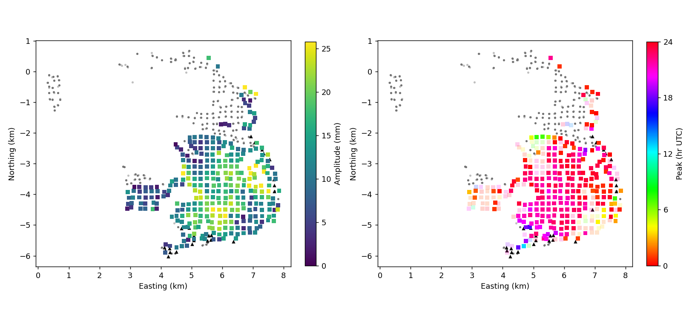
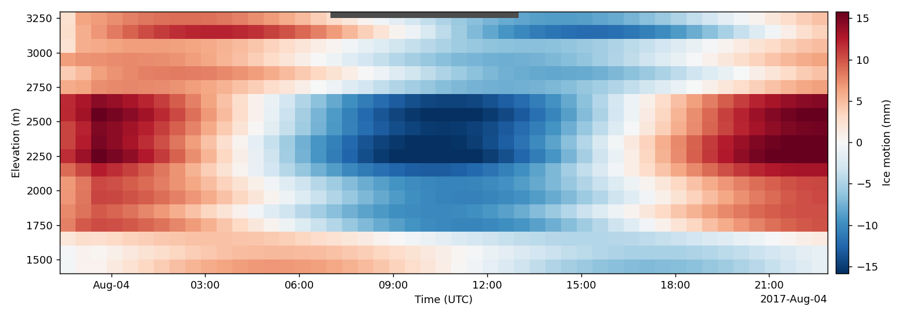

# One inversion for the path and the ice

The ladder ([`atmosphere.md`](atmosphere.md)) and the temporal path delay
([`pathdelay.md`](pathdelay.md)) are separate steps, each fitted and then
subtracted from the series the next one sees. `gpri_tools.jointinv` replaces
them with one linear model of the **uncorrected, integrated series of both
antennas**, solved for a whole campaign at once, and
`examples/baker_joint.py` runs it on every campaign.

## The model

The scene is cut into 200 m ground cells of four kinds: the fit half of the
stable ground, RGI ice (mean coherence ≥ 0.5), candidate reference ground,
and the held-out half of the stable ground. Each antenna's series is reduced
to one median per cell and epoch. Heights are the 2015 USGS lidar DEM
(1 m, flown 26 August–27 September 2015; `GPRI_DEM_LIDAR`), with the
Copernicus 30 m DEM where the lidar has no coverage. At every epoch each value
of the fit rock, the ice and the candidates is

    y_k = F beta_k + s_k + E (G_k theta + a_k) + n_k

| term | what it is | prior |
|---|---|---|
| `F beta_k` | a trend in slant range, its square and height | flat, per epoch |
| `s_k` | the path field over rock, ice and candidates alike, exponential covariance, amplitude allowed to grow with range | per epoch, scaled by the rock's own variance |
| `theta` | per ice or candidate cell, constant in time: offset, rate, 24 h cosine and sine (rate only on a record under a day) | flat on ice |
| `a_k` | ice motion that is neither: a Gaussian process over the ice cells, 600 m | per epoch |
| `n_k` | noise per antenna sized from upper − lower, each cell's own level from its own difference, plus a part shared by both antennas | — |

`theta` is solved by generalized least squares over every epoch at once with
everything else marginalised. The shape of the path prior (length scale,
growth with range, shared noise) is chosen per campaign by marginal likelihood
on the fit-half rock. The held-out rock never enters the solve. The path is
predicted there afterwards, and the difference scores the model.

## Candidate reference ground

Above 2300 m the reference has 4–7 cells per campaign. The candidates are
coherent ground off the outlines that the reference rules exclude: inside the
100 m outline buffer, or at mean coherence 0.6–0.85, at or above 2300 m (85–89
cells per campaign; the cache keeps candidates of every height and
`--cand-min-z` picks them). Each gets its own offset, rate and 24 h terms, and its own
remainder, so a moving candidate describes itself instead of feeding the path.

Whether a candidate is stationary is decided once per ground location, from
all seven campaigns together. The tripod position is the same to about 4 m in
every campaign, so the cell lattice is shared.

- **The stationary spread** for a candidate's motion terms is its own formal
  variance from the solve, scaled by a factor measured on the held-out rock
  (`calibrated_spike`). For that one calibration solve the held-out rock is
  entered as free candidates, and the scored solve never contains it.
- **Why per candidate.** A candidate beyond the rock carries the path field's
  extrapolation error in its rate and harmonic. Held-out rock sitting among the
  fit rock never sees that error.
- **The decision.** A two-component mixture (still / moving) sums its
  evidence over campaigns (`shared_stationarity`). The posterior probability
  `p` then sets a prior precision `p / spread` on the candidate's motion terms
  and a remainder `(1 − p) a2`.

The calibration factor itself is a measurement. Across the seven campaigns
the formal variance of a held-out rock cell's motion terms under-states the
truth by 14× to 520×, because the model treats path and remainder as
independent between epochs:

| campaign | path length | range growth | shared noise | calibration (rate, cos, sin) |
|---|---:|---:|---:|---|
| `20170713_full` | 500 m | 0.4 /km | 2× | 48, 14, 19 |
| `20170803_full` | 1000 m | 0 | 2× | 68, 45, 32 |
| `20170827` | 500 m | 0 | 2× | 518, 51, 77 |
| `20170913` | 4000 m | 0 | 9× | 99 |
| `20180709` | 1000 m | 0 | 2× | 77 |
| `20180808` | 2000 m | 0.4 /km | 9× | 109, 29, 16 |
| `20190719` | 1000 m | 0 | 2× | 218, 24, 54 |

The calibration uses every other held-out cell; the rest are kept back to
test the classification (below).

Of 90 candidate locations, 25 come out stationary (p > 0.5): 9 of 28 at
2300–2500 m, 16 of 48 at 2500–2900 m, none of 13 above 2900 m. They lie at
2310–2830 m and 7.0–8.8 km slant range.

### How well it tells still ground from moving

Ground whose state is known goes through the same mixture, which is not
refitted for it. The test rock is the half of the held-out rock the
calibration did not use (187 locations), and the moving ground is the ice
(340 locations):

| evidence used | held-out rock called still | ice called still |
|---|---:|---:|
| rate and 24 h terms (the default) | 79 % | 15 % |
| rate only | 83 % | 23 % |
| 24 h terms only | 40 % | 8 % |

With the default, ice above 2500 m is called still at 3 % of 77 locations and
at 2300–2500 m at 7 % of 60. Held-out rock below 2300 m is called still at
79 % of 180. The probability, not the call, enters the final solve, as the
prior precision and the remainder share.

## Scores on held-out rock

Anomaly RMS of the pixel-weighted mean series over the held-out cells (about
each series' own secular line), and its 24 h amplitude, in mm. Each row
compares three products on the same cells: the ladder (upper antenna), the
joint inversion without candidates, and with them.

| campaign | above 2500 m, RMS | above 2500 m, 24 h | below 2300 m, RMS | below 2300 m, 24 h |
|---|---|---|---|---|
| `20170713_full` | 4.30 / 3.76 / 3.50 | 2.49 / 4.65 / 4.40 | 0.36 / 0.23 / 0.22 | 0.28 / 0.14 / 0.14 |
| `20170803_full` | 8.73 / 2.53 / 1.82 | 6.92 / 2.52 / 1.55 | 0.89 / 0.29 / 0.29 | 0.80 / 0.34 / 0.34 |
| `20170827` | 9.36 / 2.61 / 2.85 | 3.01 / 0.48 / 0.53 | 0.89 / 0.27 / 0.27 | 0.51 / 0.07 / 0.07 |
| `20170913` | 2.39 / 1.04 / 0.65 | — | 0.17 / 0.04 / 0.04 | — |
| `20180709` | 4.11 / 0.99 / 0.76 | — | 0.21 / 0.23 / 0.23 | — |
| `20180808` | 19.06 / 7.28 / 7.74 | 17.14 / 7.06 / 8.17 | 0.45 / 0.34 / 0.35 | 0.45 / 0.11 / 0.10 |
| `20190719` | 9.57 / 6.44 / 5.90 | 10.41 / 7.75 / 7.36 | 0.73 / 0.21 / 0.21 | 0.89 / 0.15 / 0.14 |

Above 2500 m the scores rest on 4–7 held-out cells per campaign.

## The ice

24 h amplitude of the pixel-weighted mean phasor over the ice cells, its hour
of peak, the median single-cell amplitude, the median per-cell sigma (formal,
scaled by the held-out calibration above), and the mean rate:

| campaign | below 2300 m | above 2500 m |
|---|---|---|
| `20170713_full` | 4.22 mm at 05.4 h; cell 6.04 ± 5.71 mm; +11.1 m/yr | 3.60 mm at 14.1 h; cell 5.97 ± 12.99 mm; +20.7 m/yr |
| `20170803_full` | 10.62 mm at 22.9 h; cell 11.67 ± 4.88 mm; +38.5 m/yr | 10.94 mm at 23.9 h; cell 12.54 ± 5.55 mm; +28.1 m/yr |
| `20170827` | 9.35 mm at 17.5 h; cell 7.80 ± 4.19 mm; +17.2 m/yr | 8.97 mm at 19.5 h; cell 10.68 ± 4.40 mm; +0.7 m/yr |
| `20180808` | 5.48 mm at 00.4 h; cell 7.14 ± 3.87 mm; +31.9 m/yr | 5.63 mm at 22.3 h; cell 8.51 ± 6.69 mm; +24.6 m/yr |
| `20190719` | 7.37 mm at 15.6 h; cell 7.47 ± 3.70 mm; +34.3 m/yr | 13.00 mm at 20.4 h; cell 13.75 ± 4.00 mm; +17.7 m/yr |

Hours are UTC. With the calibrated sigma, a single 200 m cell's 24 h
amplitude is one to about three and a half times its error.



`40_joint_<campaign>.png`: amplitude (left) and hour of peak (right) of each
ice cell's 24 h terms. A peak hour is drawn solid where the amplitude exceeds
twice its calibrated sigma. Grey dots are fit-half (light) and held-out (dark)
rock cells, and black triangles are the candidates found stationary.



`41_joint_bands_<campaign>.png`: each ice cell's 24 h terms plus its
remainder, rate and offset removed, averaged in 100 m elevation bands and
30-minute bins. The dark bar on the top edge marks local night, 00–06 at
UTC−7.

## Two choices the held-out rock decided

Two settings were run on all seven campaigns and scored the same way. The
first is whether candidates are admitted at every height or only at or above
2300 m. The second is whether the noise the antennas share is one level fitted
on the rock (`--shared-noise global`) or measured per cell
(`gpri_tools.jointinv.shared_noise`: each cell's step in the antenna mean,
minus its neighbours' mean step, less the independent part). Held-out rock
anomaly RMS, mm, with candidates (the stationary spread calibrated on all of the
held-out rock in this comparison):

| campaign | ≥2300 m, global | ≥2300 m, per cell | all heights, global | all heights, per cell |
|---|---|---|---|---|
| `20170713_full` | 3.53 / 0.22 | 3.50 / 0.36 | 3.52 / 0.25 | 3.90 / 0.50 |
| `20170803_full` | 1.83 / 0.29 | 2.10 / 0.32 | 1.73 / 0.62 | 2.12 / 1.48 |
| `20170827` | 2.85 / 0.27 | 3.45 / 0.55 | 2.81 / 1.00 | 3.86 / 2.82 |
| `20170913` | 0.65 / 0.04 | 0.45 / 0.04 | 0.73 / 0.06 | 0.48 / 0.10 |
| `20180709` | 0.77 / 0.23 | 0.81 / 0.22 | 0.77 / 0.32 | 0.82 / 0.52 |
| `20180808` | 7.83 / 0.35 | 7.12 / 0.35 | 7.84 / 0.99 | 7.21 / 1.50 |
| `20190719` | 5.94 / 0.21 | 7.63 / 0.28 | 5.97 / 0.41 | 7.75 / 0.78 |

Each entry is held rock above 2500 m / below 2300 m. Admitting candidates at
every height (435–479 cells, 160–181 of 521 locations found stationary) leaves
the far rock about where it was and makes the low rock worse on every
campaign, 0.21–0.35 mm becoming 0.25–1.00 mm. Per-cell shared noise measures
2–4× each antenna's own noise on rock and 1.7–3.6× on candidates, so the
candidates are no noisier by that measure. Using it is worse than the single
fitted level on four campaigns at the low rock. The defaults are therefore
candidates at or above 2300 m with one shared level, the first column.

## What it does not do

- **Error bars.** The path and the remainder are independent between epochs
  in the model, so formal uncertainties are lower bounds. The calibration
  table says by how much on held-out rock.
- **Unit gain on ice-only signals.** `theta` has no prior, so a signal
  confined to the ice comes back at unit gain by construction. The test that
  means something is a signal shared by rock and ice. `inject_shared` measures
  how much of one leaks into the ice's harmonic, and a pattern inside the trend
  terms leaks none (`tests/test_jointinv.py`).
- **Far ice.** Beyond 7.4 km the stable ground is 47–97 pixels per campaign,
  out to 9.0 km, and the ice reaches 9.2 km. The far ice's harmonic still
  rests on those pixels and on the candidates found stationary near them.

## Reproduce

```bash
# cell series of both antennas (and the ladder's, for the scores), the path
# prior and the calibration solve, stationarity across campaigns, final solve
python examples/baker_joint.py --stage all
# or in steps, e.g. after changing the candidate rules
python examples/baker_joint.py --stage cells --scenes 20180808
python examples/baker_joint.py --stage A
python examples/baker_joint.py --stage EM
python examples/baker_joint.py --stage B
```
