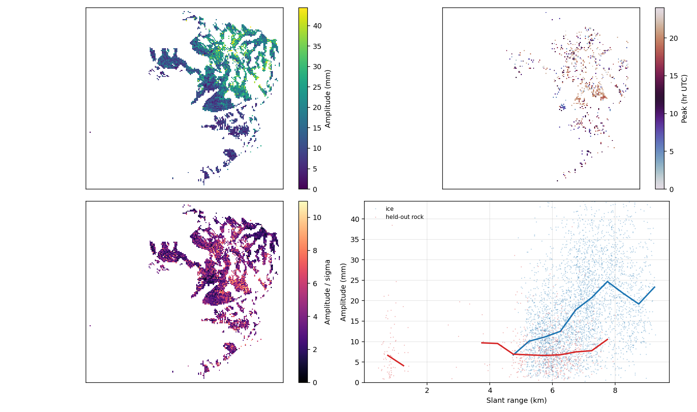
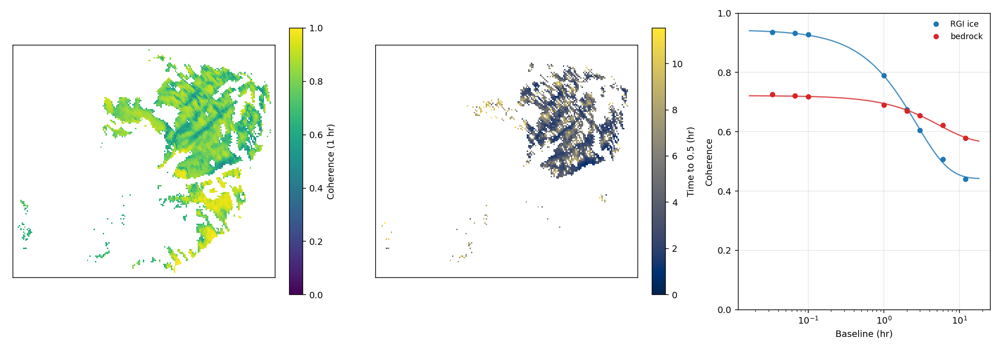
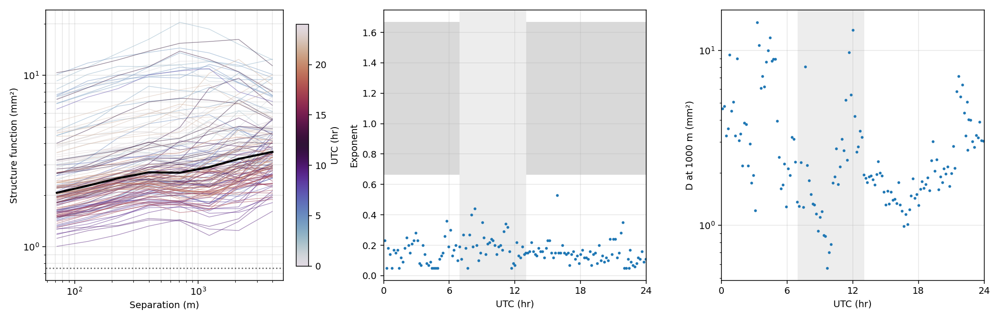
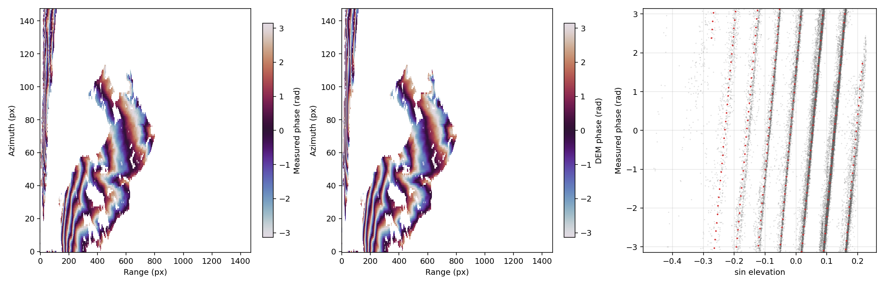
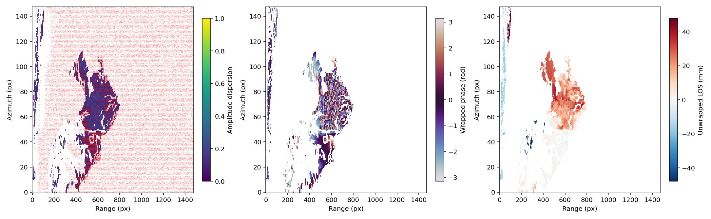
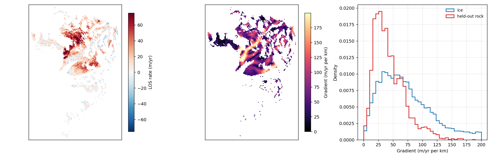

# Other things this data measures

The rest of this repository estimates one quantity — line-of-sight
displacement — and spends its effort separating it from the atmosphere.  The
same acquisitions carry several other measurements that cost nothing extra,
because they are made from products already on disk.  This page collects
them.  Each one is a library module, an example script, a figure and a
number; none of them reinterprets the deformation analysis.

Every script here reads the corrected series the rest of the analysis
ships: reference, per-epoch drift, per-epoch turbulence screen, then the
temporal path delay of [`gpri_tools.pathdelay`](pathdelay.md), which
`--no-path-delay` leaves in where the script takes that flag.

## The 24 h harmonic, per pixel

`baker_population.py` reads the median of the ice against the median of the
held-out bedrock; `examples/baker_harmonics.py` fits the same 24 h harmonic
to every pixel (`gpri_tools.diurnal.fit_harmonics`) and maps amplitude, hour
of peak, and amplitude over its own one-sigma.

**The error bar is the whole question here, and the first version of it was
wrong.**  `HarmonicFit.amplitude_sigma` propagates the residual about the
fitted model, which counts every epoch as an independent sample.  These
series are random walks: the low-frequency wander a harmonic absorbs leaves
a small residual behind, so the white-noise error bar came out roughly ten
times too small and called everything significant.
`gpri_tools.diurnal.effective_sample_factor` measures the inflation from
each pixel's own residual autocorrelation and `amplitude_sigma(inflation=)`
applies it.  On a pure random walk with no signal at all, the white-noise
bar reports A/sigma ≈ 12 and the corrected one reports 1.3, which is a test
in `tests/test_diurnal.py`.



| campaign | ice amplitude | ice sigma | ice A/sigma | rock amplitude | rock sigma | rock A/sigma | inflation |
|---|---:|---:|---:|---:|---:|---:|---:|
| `20170713_full` | 12.34 mm | 4.00 | **2.98** | 7.43 mm | 2.59 | **2.94** | 5.4× |
| `20170803_full` | 16.71 mm | 4.89 | **3.34** | 6.94 mm | 1.92 | **3.55** | 9.2× |
| `20170827` | 14.12 mm | 8.70 | **1.57** | 8.16 mm | 3.68 | **2.11** | 14.6× |
| `20180808` | 17.07 mm | 8.35 | **1.85** | 7.50 mm | 4.02 | **1.77** | 13.7× |
| `20190719` | 12.28 mm | 7.23 | **1.61** | 7.01 mm | 3.36 | **2.00** | 12.7× |

Read the two A/sigma columns against each other.  Held-out bedrock does not
move, so its column is what this statistic returns for noise — and on every
campaign the ice's is the same size, twice below it.  **By the per-pixel
harmonic the ice is not distinguishable from ground that does not move.**
The ice's amplitude is larger (12–17 mm against 7–8 mm), but so is its
uncertainty, and the ratio is what decides a detection.

That is not a statement about the population median, which is a different
and much tighter measurement: [`baker.md`](baker.md) separates ice from rock
there by a factor of ten or more.  Averaging thirty thousand pixels beats
the per-pixel random walk down; fitting each pixel alone does not.

## Decorrelation: coherence as the measurement

Everywhere else coherence is a weight.  The long-baseline pair caches — the
ones the multi-baseline path delay needed, lags of 1 to 360 or 720 epochs —
carry a coherence per pair per pixel, so every pixel's decorrelation curve
is already on disk.  `gpri_tools.decorrelation` reduces the stack to one
coherence per baseline class (by epoch lag, which is immune to cadence
jitter) and reads off the baseline at which each pixel crosses a coherence
level.  `examples/baker_decorrelation.py` maps it.



| campaign | classes | ice: time to γ = 0.5 | crosses | rock: time to γ = 0.5 | crosses | fitted τ, ice / rock |
|---|---:|---:|---:|---:|---:|---|
| `20170803_full` | 8 | 0.76 h | 82.8 % | 4.16 h | 53.6 % | 0.84 / 2.71 h |
| `20170827` | 9 | 1.06 h | 81.4 % | 5.53 h | 50.7 % | 1.01 / 3.19 h |
| `20170913` | 8 | 4.27 h | 73.9 % | 7.83 h | 27.6 % | 2.69 / 5.46 h |
| `20180709` | 6 | 0.69 h | 74.9 % | 1.76 h | 28.4 % | 0.87 / 1.62 h |
| `20180808` | 9 | 0.97 h | 80.2 % | 5.01 h | 56.9 % | 0.89 / 1.73 h |
| `20190719` | 9 | 1.52 h | 88.7 % | 4.41 h | 71.2 % | 1.35 / 3.49 h |

The median is over the pixels that do cross within the record; the "crosses"
column says how many those are, and it belongs beside the median because a
pixel that never reaches γ = 0.5 has no crossing time and is not averaged
in.  `τ` is from `exponential_decorrelation`, the usual
`(γ0 − γ∞) exp(−t/τ) + γ∞` fitted to the mask-median curve, which is a
different estimator answering a related question: the curve's scale rather
than a level crossing.

Two limits.  A coherence estimated from `L` looks is biased high, so the
long-baseline end is a ceiling, not a measurement; the bias depends only on
`L`, so it moves every class the same way and the shape survives.  And a
crossing time is bounded by the record: `20170913` spans 14.5 h and its
longest class is 12 h, so nothing slower than that is measurable in it.

## Turbulence: what the screen is removing

The ladder convolves at `sigma = (5, 25)` pixels, which is a claim about the
distance over which the atmosphere stays coherent.
`gpri_tools.turbulence.structure_function` measures it:
`D(r) = <[phi(x+r) - phi(x)]^2>` over pixel pairs binned by ground
separation, on bedrock, per epoch.  A structure function needs no mean, so
the arbitrary constant and ramp a bedrock-fitted screen carries do not enter
it.  The field measured is the epoch-to-epoch increment, because the
integrated series' structure function grows with time from the reference
epoch, which is a property of the integration and not of the air.

**A bare power law was the wrong model.**  Two independent pixels differ by
`2 * variance` however far apart they are, so per-pixel noise puts a
separation-independent floor under `D(r)`; fitting `D ~ r^alpha` through
that floor returns an exponent near zero and makes noise look like a flat
atmosphere.  `power_law_with_floor` fits `D = floor + A (r/r0)^alpha`
instead, and the floor is **pinned** at the Cramer-Rao noise the pairs' own
coherence implies (`--floor crb`) rather than fitted, because eight
separation bins cannot constrain three parameters.



| campaign | noise floor | exponent above it (p16–p84) | structure at 1 km | air's share of D at 1 km |
|---|---:|---|---:|---:|
| `20170713_full` | 0.69 mm | +0.10 (+0.06 to +0.20) | 7.75 mm² | 89 % |
| `20170803_full` | 0.61 mm | +0.15 (+0.08 to +0.23) | 2.17 mm² | 74 % |
| `20170827` | 0.60 mm | +0.21 (+0.10 to +0.36) | 2.90 mm² | 80 % |
| `20170913` | 0.49 mm | +0.16 (+0.13 to +0.19) | 1.10 mm² | 70 % |
| `20180709` | 0.58 mm | +0.23 (+0.13 to +0.40) | 3.17 mm² | 83 % |
| `20180808` | 0.68 mm | +0.13 (+0.06 to +0.21) | 3.79 mm² | 80 % |
| `20190719` | 0.63 mm | +0.19 (+0.10 to +0.30) | 2.65 mm² | 77 % |

With the floor accounted for, 70 to 89 % of `D` at a kilometre is structure
rather than noise, and the exponent above the floor is +0.10 to +0.23 —
still far below the 2/3 to 5/3 a Kolmogorov field would give over these
separations, which the figure shades.  Differencing over an hour instead of
one cadence (`--lag 30`) scales the structure up by an order of magnitude
(29.0 mm² at 1 km on `20170803_full`) and leaves the exponent at +0.36, so
the flatness is not an artefact of a short interval.

The script prints the ladder's own sigma converted to metres on the same
geometry (89 × 296 m on `20170713_full` at dec 16), so the smoothing scale
and the measured separations can be read against each other.

## The two antennas as an interferometer

The GPRI-II receives on two antennas 25 cm apart on one mast, sampled in the
same sweep, so `s_upper * conj(s_lower)` at one epoch has no temporal
decorrelation, no deformation and no atmospheric delay beyond the difference
over 25 cm.  What is left is geometry — the path-length difference set by
each target's elevation angle — which makes it a topographic measurement the
radar makes of itself.  `examples/baker_antenna_interferogram.py` forms it
and compares it against the DEM `gpri_tools.heading.target_heights` reads.

Three things had to be handled before the comparison meant anything, and the
third was a hypothesis that the data rejected.

The two receive chains carry a relative phase that is constant across the
scene and changes sweep to sweep; averaging epochs without removing it
cancels the geometry instead of the noise, so each epoch's scene-constant
phase comes out before the epochs are stacked.

The fit of the measured phase against the DEM's `sin(theta)` is **aliased**:
with `2 pi B / lambda` of order ninety radians, slopes differing by about
0.7 fit nearly as well, so the script scores the slopes the geometry allows
(one-way, two-way, half), refines locally, and prints the unconstrained scan
beside them rather than trusting it.

And the low cross-antenna coherence looked like it might be a multilook
artefact: at a height ambiguity of tens of metres the topographic fringe
turns several times across fifteen range samples, which would average the
fringe away.  The script therefore removes the DEM's phase at **full
resolution** before taking looks, for each candidate geometry.  It makes no
difference whatever:

| campaign | coherence unflattened | flattened at k = 1 | phase agreement with the DEM |
|---|---:|---:|---:|
| `20170713_full` | 0.181 | 0.180 | 0.411 |
| `20170803_full` | 0.178 | 0.178 | 0.426 |
| `20170827` | 0.179 | 0.179 | 0.021 |
| **`20170913`** | 0.181 | 0.181 | **0.906** |
| `20180808` | 0.176 | 0.176 | 0.051 |
| `20190719` | 0.174 | 0.174 | 0.018 |

So the ~0.18 is intrinsic to the cross-antenna pair, not lost in the looks —
one explanation tested and struck off.



The phase is a different matter from the coherence, and on `20170913` it
reads topography unambiguously: the one-way slope wins at 0.897 against
0.048 for two-way and 0.149 for half, the refinement lands at 0.98 of the
one-way prediction, and the residual against the DEM is 26 m of height at
the median range of 5.2 km where a cycle is 369 m.  The measured and
predicted fringe patterns in the figure are the same picture.

On the other five it does not, and four explanations are now ruled out: the
two antennas' epoch lists align exactly by index on every campaign; the
per-epoch coherence is the same everywhere (0.174 to 0.181); flattening
before multilooking changes nothing; and scanning the DEM's registration
over ±12 azimuth and ±4 range pixels moves the agreement by at most 0.02.
What separates `20170913` from the rest is still open.

## Speckle tracking

`gpri_tools.tracking.patch_offsets` cross-correlates patches, which measures
displacement with no phase ambiguity and no coherence requirement, at a
resolution set by the cell size.  `examples/baker_tracking.py` runs it
between two epochs and puts the answer beside the phase's over the same
interval.

**What is correlated decides whether this works at all.**  Correlating raw
intensity matches speckle — a different random field in every acquisition,
which is exactly what does not repeat — and returns a median peak
correlation of 0.02.  `gpri_tools.tracking.texture` takes dB intensity,
multilooks it and subtracts a Gaussian-smoothed copy, leaving the
ridge-and-shadow pattern of the ground; this is the preprocessing
`gpri_tools.coregister` already uses to hold a campaign's heading.  With it,
at 4 × 16 looks, the median peak correlation goes to **0.89–0.93**.  Patch
size matters as much: at those looks the median peak runs 0.13, 0.43, 0.89,
0.93 for patches of 16×32, 32×64, 48×128 and 64×256 cells, so this
instrument needs a footprint of hundreds of metres before tracking
correlates at all — which is itself the resolution limit of the method here.

Because a patch covers that much ground, each one is assigned to a
population by what its **footprint** covers rather than by the pixel at its
centre.

| campaign | patches | range offset | line of sight | phase over the same 2 h |
|---|---:|---:|---:|---:|
| `20170913` ice | 129 | −0.102 ± 0.140 samples | −77 ± 105 mm | +8.1 mm |
| `20170913` bedrock | 34 | −0.080 ± 0.092 samples | −60 ± 69 mm | +8.6 mm |
| `20170803_full` ice | 91 | −0.133 ± 0.119 samples | −100 ± 89 mm | +8.0 mm |

Ice and bedrock agree inside their scatter, which over two hours — where the
phase reports about 8 mm and a range sample is 75 cm — is the right answer.
The bedrock row is the noise floor: **60–70 mm in line of sight against the
phase's 2.7–3.2 mm**, so tracking is some twenty times coarser here.  Read
the other way, a target would have to move about 2.5 m/day in line of sight
before tracking could see it at three sigma over a 2 h pair, which is the
number to have before reaching for tracking on faster ice than Baker's.

## Persistent scatterers in the far field

`gpri_tools.psinterp` implements Chen, Zebker & Knight's PS-interpolation
unwrapping and no Baker script had used it.  The place it belongs is the
weak spot [`baker.md`](baker.md) documents: beyond 7 km, where 46 % of the
ice sits against 308 of the 7,697 stable pixels, the rock-fitted screens are
extrapolating.  `examples/baker_ps.py` selects scatterers by amplitude
dispersion over the record, unwraps a long-baseline interferogram at them
along a minimum spanning tree in **ground metres** (the GPRI's pixel spacing
is anisotropic enough that a tree built in pixels picks the wrong
neighbours), and interpolates back onto the grid.



On `20170913` at 3 × 15 looks, 40,000 pixels pass a dispersion of 0.25 —
18 % of the grid, 3,185 of them on ice and 2,644 on bedrock — and their
density rises with range rather than falling:

| range (km) | 0–1 | 2–3 | 4–5 | 5–6 | 6–7 | 7–8 | 9–10 | 12–13 | 16–17 |
|---|---:|---:|---:|---:|---:|---:|---:|---:|---:|
| PS share | 1.7 % | 11.9 % | 17.1 % | 26.4 % | 28.7 % | 24.9 % | 19.1 % | 18.4 % | 19.1 % |
| PS on ice | 0 | 0 | 23 | 800 | 615 | 999 | 54 | 0 | 0 |

So the far field the screens cannot reach is not empty of usable targets:
at 7–8 km, where the modelled stratification residual is 70 % of what it
started as, there are 999 persistent scatterers on the ice itself.

Unwrapping the 6 h interferogram at those targets moved 86 % of ice pixels
by a whole cycle or more (up to five cycles) and 47 % of bedrock pixels (up
to seven), with no unresolved targets and a suspect fraction — pixels whose
residual came back near π, where the subtract-wrap-add step aliased — of
8.7 % on ice and 4.7 % on bedrock.  That suspect map is the honest failure
map, not a quality score.

## Phase linking, and the quality number it brings

`gpri_tools.covariance` and `gpri_tools.phaselink` had likewise never been
run on this data.  `examples/baker_phaselink.py` builds the N × N sample
coherence matrix per pixel and factors it for the per-epoch phases that
explain every pair at once, rather than the chain's consecutive differences.

The configuration decides the answer, and the script makes that visible with
`--spread`:

| mini-stack | temporal coherence, ice / rock | linked sd, ice | chain sd, ice | linked − chain |
|---|---|---:|---:|---:|
| 24 consecutive (48 min) | 0.999 / 0.995 | 4.07 mm | 4.01 mm | 1.40 mm |
| 24 spread over 13.8 h | 0.038 / 0.048 | 4.98 mm | 27.70 mm | 28.12 mm |

Linked consecutively the rank-one model is essentially exact and the series
agrees with the chain to 1.4 mm; spread across the record, the pairs have
decorrelated (the decorrelation section above says ice reaches γ = 0.5 in
4.3 h on this campaign), the model fits nothing, and the "linked" series is
flat where the chain has 27.7 mm of motion.

What linking adds is `temporal_coherence`, a per-pixel number the chain
cannot produce: on the consecutive mini-stack 96.3 % of ice pixels and
61.1 % of held-out bedrock reach 0.6.  The chain cannot tell a pixel whose
steps are mutually consistent from one whose steps merely integrate.

## Velocity gradients

The spatial derivative of the per-pixel rate is what a strain rate is made
of.  The rates it differentiates are the same ones the harmonic section
measures, so the bedrock control there applies here too: the comparison
below is the whole content of the map.  `examples/baker_strain.py` fits a plane to the line-of-sight rate over
a 200 m ground neighbourhood at every pixel and maps the gradient, taking
the rates from `baker_harmonics.py`'s cache where one exists.



On `20170827`: the ice's rate is +13.7 m/yr (p16–p84 −7.3 to +41.6) and its
gradient 64.1 m/yr per km (p16–p84 28.8 to 118.4); held-out bedrock, which
does not move, gives +0.2 m/yr and a gradient of 37.9 m/yr per km (19.4 to
68.3).  **The ice's gradient is 1.7 times the bedrock's**, and that ratio is
what the map is worth: differentiating a rate differentiates its noise, and
the bedrock row says how much of the ice's structure is that.  Across the
five campaigns that carry a per-pixel rate the ratio runs 1.3, 1.7, 2.6, 3.1
and 3.6 (`20170713_full`, `20170827`, `20180808`, `20190719`,
`20170803_full`), so how much the gradient map is worth is a property of the
campaign, not of the method.

Two limits the script prints rather than hides: one look direction gives one
component of a three-dimensional velocity field, so this is the gradient of
the line-of-sight rate and not a strain-rate tensor; turning it into one
needs a flow direction and a depth assumption this data cannot supply.

## Reproduce

```bash
# the 24 h harmonic per pixel, for every campaign that spans a cycle
for s in 20170713_full 20170803_full 20170827 20180808 20190719; do
  python examples/baker_harmonics.py --scene $s --decimate 16 --rgi
done
# coherence against temporal baseline, from the long-baseline pair caches
python examples/baker_decorrelation.py --scene 20170913 --lags 1 2 3 30 60 90 180 360
python examples/baker_decorrelation.py --scene 20170827 --lags 1 2 3 30 60 90 180 360 720
# the structure function of what the turbulence screen removes, with the
# noise floor pinned at what the pairs' coherence implies
for s in $CAMPAIGNS 20180709; do
  python examples/baker_turbulence.py --scene $s --rgi
done
python examples/baker_turbulence.py --scene 20170803_full --rgi --lag 30   # over an hour
# the two antennas as an interferometer, against the DEM
for s in $CAMPAIGNS; do
  python examples/baker_antenna_interferogram.py --scene $s --epochs 16
done
# speckle tracking beside the phase, over a two-hour pair
python examples/baker_tracking.py --scene 20170913 --hours 2 --rgi
# persistent scatterers, and unwrapping a six-hour interferogram at them
python examples/baker_ps.py --scene 20170913 --hours 6
# phase linking a consecutive mini-stack, and the same epochs spread out
python examples/baker_phaselink.py --scene 20170913 --epochs 24
python examples/baker_phaselink.py --scene 20170913 --epochs 24 --spread even
# the gradient of the per-pixel rate (needs baker_harmonics.py first)
for s in $CAMPAIGNS; do python examples/baker_strain.py --scene $s --rgi; done
```
