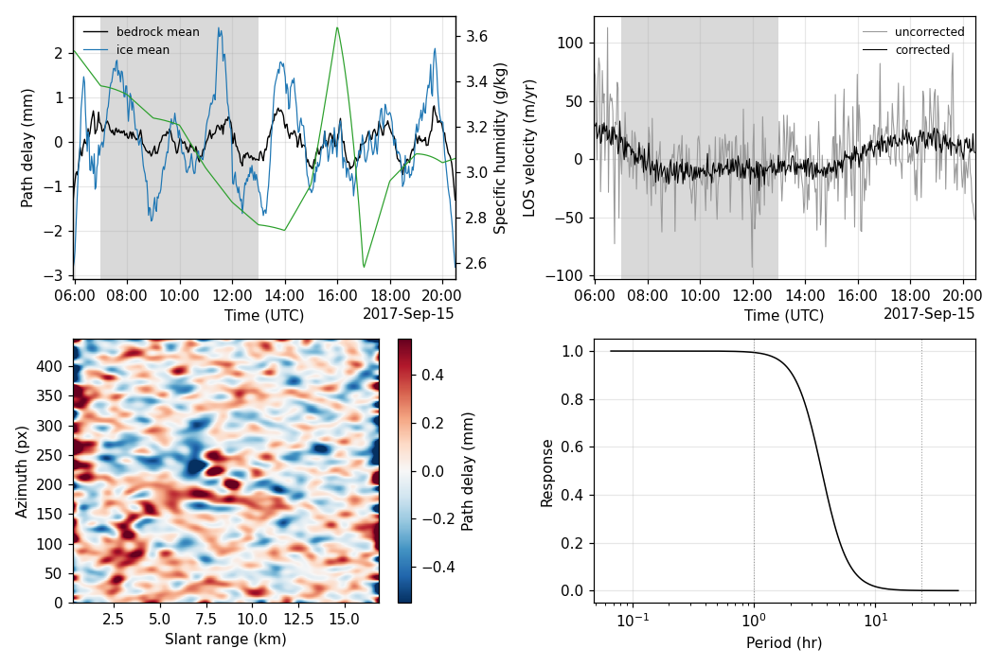

# The path delay, from the pairs themselves

[`docs/atmosphere.md`](atmosphere.md) separates air from ice **spatially**: a
screen fitted on stable ground and subtracted everywhere. That needs bedrock
in the frame, and it removes only what the screen model can express.
`gpri_tools.pathdelay` separates them **temporally** instead, the way the
terrestrial-radar literature does (Wild et al., double-difference DInSAR on
Grenzgletscher). Nothing is fitted on rock.

## The double difference

Each pair's line-of-sight displacement, in the `d_j - d_i` convention
`invert_network` uses, carries the surface's motion and the air's delay in
the same difference:

    b_p = (d_j - d_i) + (a_j - a_i)          p = (i, j)

Take two pairs sharing their middle epoch, `p = (i, j)` and `q = (j, k)`, and
difference them after dividing each by its own span:

    D = b_p / dt_p - b_q / dt_q
      = -a_i / dt_p + a_j (1 / dt_p + 1 / dt_q) - a_k / dt_q

A surface moving at a steady rate contributes `v - v = 0` — exactly, at any
spacing, which is what the division by the spans buys. Equally spaced epochs
give the familiar `(-1, 2, -1) / dt` second difference. Every such triplet is
one row of `A`; `double_difference` builds it, and `invert_path_delay` solves
`A a = b` for one delay per acquisition with Tikhonov regularisation,

    a = (A^T A + lam I)^-1 A^T b

with `lam` from generalised cross-validation (`select_lambda`) unless it is
given.

## What the system cannot see

**An affine delay.** `A` annihilates `a_i = alpha + beta t_i`: a delay that
grows linearly in time is exactly what a steady rate looks like, and the
double difference was built to remove that. The null space is two
dimensional, so the answer is unique only after a representative is chosen.
`pin_affine` removes the least-squares trend in time; `pin_rate` removes
instead the trend that would change the mean apparent velocity, so that the
correction provably leaves every rate alone. The examples use `pin_rate`,
and report the trend so discarded — the size of the unobservable part, in
the units it would otherwise be mistaken for: between **−1.01 and +1.22
m/yr** across the six campaigns.

**Slow atmosphere, or unsteady flow.** Motion and delay enter identically,
so nothing separates them but the assumption that the motion is linear in
time. Everything in the phase that is not linear in time is called
atmosphere here, whatever put it there. What reaches the system at all is
set by the operator: a component of period `T` sampled at spacing `dt`
arrives weighted by `4 sin^2(pi dt / T) / dt`, which vanishes as `T` grows,
and the regularised solve returns `g^2 / (g^2 + lam)` of it.
`frequency_response` evaluates that product for one equally spaced triplet
and `system_response` measures it on the operator actually being inverted.
**Left to cross-validation it is not small on every campaign:** GCV gives
`20170713_full` a response of 0.58 at 24 h, so the correction would take more
than half of any diurnal signal with it. That is what the weight floor below
is for, and the examples apply it by default.

## Three estimators, and the split-half score

Bedrock is not needed to estimate the delay, but it is still what scores it.
`examples/baker_pathdelay.py` keeps the ladder's rule — the stable mask is
split in half, one half feeds the estimate and the other is never touched by
it — and runs three estimators so the honest number and the flattering one
sit side by side:

| estimator | what it fits | scored how |
|---|---|---|
| `scene` | one delay series for the frame, from the spatial mean of the fit-half bedrock | on the held-out half, which it never saw |
| `pixel` | one delay series per pixel | a control: one unknown per epoch against one observation per pair, so it fits the pixel's own noise |
| `smooth` | the per-pixel field, Gaussian-smoothed over (5, 25) px | the spatially coherent part of the same field |

The score is the standard deviation of the apparent LOS velocity `b_p / dt_p`
before and after the delay is removed, in m/yr. For `scene` the mask is
averaged first; for `pixel` and `smooth` each pixel is scored on its own
series and the spreads are averaged, which is why their "before" columns are
an order of magnitude larger.

## The six campaigns

Reduction in the scatter of apparent LOS velocity, per estimator, on the
held-out bedrock the estimate never saw and on the coherent ice:

| campaign | epochs | baselines (min) | lam | raised by the floor | response 2 h | response 24 h | `scene` rock | `pixel` rock | `smooth` rock | `smooth` ice | trend discarded (m/yr) |
|---|---:|---|---:|---|---:|---:|---:|---:|---:|---:|---:|
| `20170713_full` | 271 | 4.1–42.7 | 11.35 | from 0.014 | 0.966 | 0.010 | 65.6 % | 85.2 % | 3.9 % | 5.2 % | +0.03 |
| `20170803_full` | 723 | 2.0–6.3 | 14.97 | no | 0.794 | 0.002 | 41.1 % | 84.0 % | 4.4 % | 7.8 % | −1.01 |
| `20170827` | 1,335 | 2.0–19.3 | 0.698 | from 0.083 | 0.988 | 0.010 | 64.1 % | 90.4 % | 5.3 % | 9.7 % | +0.39 |
| `20170913` | 437 | 2.0 | 5.82 | no | 0.892 | 0.005 | 56.5 % | 89.8 % | 2.9 % | 16.5 % | +0.06 |
| `20180808` | 1,227 | 2.0–26.9 | 0.839 | from 0.083 | 0.981 | 0.010 | 62.4 % | 90.4 % | 5.0 % | 7.8 % | −0.69 |
| `20190719` | 1,137 | 1.2–173.6 | 2.191 | from 0.750 | 0.957 | 0.010 | 56.9 % | 88.9 % | 5.6 % | 10.6 % | +1.22 |

Held-out bedrock carries 12,369 to 23,034 pixels per campaign and the
coherent ice 25,418 to 33,652; the fit and held halves are within one pixel
of each other by construction.

Three things the table says. The `scene` estimator, fitted on bedrock the
score never uses, takes 41 to 66 % off the bedrock scatter. The `pixel`
control takes 84 to 90 % off every mask including the held-out one — it is fitting each pixel's own noise, which is what a system
with one unknown per epoch and one observation per pair does, and it is in
the table to say that such a number measures nothing. Of that per-pixel
field only the 2.9 to 5.6 % that survives spatial smoothing is coherent
across neighbouring pixels.

Mean rates are identical before and after to the printed precision in every
row, on every mask — that is `pin_rate` holding, not a result.



*Figure: `20170913`. Top left, the delay per acquisition — the `scene`
estimate over bedrock and the `smooth` field averaged over ice — against the
specific humidity at the radar epochs. Top right, the apparent LOS velocity
of the held-out bedrock before and after the correction. Bottom left, the
smoothed delay field at one epoch. Bottom right, `system_response` — the
gain of the operator inverted — against period, with one hour and one day
marked. Local night (00–06) is shaded.*

## Several temporal baselines — and why they add nothing at single look

The method is built on triplets, and a daisy chain supplies only the shortest
of them. Forming interferograms at lags 1, 2 and 3 as well gives the
`(1, -2, 1)`, `(1, 0, -2, 0, 1)` and `(1, 0, 0, -2, 0, 0, 1)` rows, and
`--lags 1 2 3` does it. On `20170913` that turns 435 double differences into
3,897 for the same 437 unknowns.

**It buys no information here.** At single look an interferogram is
`s_i conj(s_j)` formed from the same SLCs, so
`arg(s_i conj(s_k)) = arg(s_i conj(s_j)) + arg(s_j conj(s_k))` identically:
the long-baseline phases are algebraic combinations of the chain, not
independent measurements. Measured on `20170803_full` with `looks=(1, 1)`,
the closure phase over 2,161 triangles is **exactly zero** — rms 0.0000 rad.
Counting rows therefore overstates the constraint: the extra rows are
perfectly dependent on the ones already there, and any noise calculation
that assumes one variance per row (including the naive `pinv` noise gain,
which falls from 0.619 to 0.099 across the two systems) is measuring the
design matrix rather than the data.

What does change is the regularisation. The weight floor is computed on the
operator it is given, and the longer baselines are more sensitive at long
periods, so holding 24 h to 1 % takes `lam` from 1.92 to 75.0. The apparent
improvement in the `pixel` control — 89.8 % of held-out bedrock scatter
"removed" with the chain, 46.1 % with three lags — is that heavier
regularisation suppressing the overfitting, not extra observations
constraining it.

**Independent baselines need multilooking**, which is the regime where the
short-baseline closure bias of De Zan et al. and Zheng et al. appears and
where `gpri_tools.closure` earns its place. `examples/baker_closure.py` reads
its stack at `--looks 3 15` for exactly that reason. Anyone extending this to
real multi-baseline data should estimate and remove that bias before forming
the double differences.

**Mixing baselines wraps.** A pair unwrapped on its own is known modulo
half a wavelength — 8.7 mm of line-of-sight displacement here — while the
chain of shorter pairs spanning the same interval is a sum and carries no
such bound. Measured at single look on `20170803_full` at lags 1, 2, 3
(2,163 pairs, 723 epochs, dec 16), the two-epoch pairs sit a whole cycle
from the chain on 10.9 % of the fit-rock, held-rock and ice samples alike
(22.7 % of all finite pixels) and the three-epoch pairs on 16.6 % of the
rock and 17.8 % of the ice (30.7 % of all), half of them each way; the
per-pixel lag-2 closure — pair (i, i+2) minus its two chain steps, unwrapped
and cycles included, where the wrapped closure above is exactly zero — has
an rms of 2.88 mm on every mask. `gpri_tools.pathdelay.rewrap_to_chain`
(`--rewrap` in `baker_pathdelay.py`) moves each longer baseline by whole
cycles onto the chain sum and leaves anything smaller than a cycle alone.
That brings the closure to 0.000 mm, takes the scene estimator's held-out
score from −33.2 % to −44.5 % (the chain alone: −41.1 %), its GCV weight
from 1043.7 down to the 57.5 floor and its delay rms from 0.626 to
1.713 mm; the smooth estimator (`pair_delay_field`, σ = (5, 25), 24 h held
to 1 %) goes from −4.1 % to −6.9 % on held-out rock and from −6.4 % to
−11.1 % on the ice, on an apparent-velocity scatter that the rewrap itself
raises from 337.8 to 375.2 m/yr on held-out rock before any correction.
(`baker_pathdelay.py --scene 20170803_full --lags 1 2 3 --rewrap`, whose
`smooth` row is the per-pixel cube Gaussian-filtered rather than
`pair_delay_field`, prints for held-out rock 69.8 → 38.8 m/yr, 44.5 %, on
the scene estimator, 375.2 → 61.2, 83.7 %, per pixel and 375.2 → 353.2,
5.8 %, smoothed, and 15.3 %, 82.4 % and 9.6 % on the ice.) On the
multilooked `20170913` (3 × 15 looks, 1,305 pairs, 437 epochs) the same
operation moves 3.0 % of the fit-rock samples at lag 2 and 4.0 % at lag 3
(0.6 % and 1.2 % of the ice; 27 % and 34 % of all finite pixels), takes the
per-pixel lag-2 closure from 1.41 to 0.64 mm on rock and 0.65 to 0.18 mm on
ice, and changes the scores by at most 2.4 points: scene −56.2 % → −56.3 %,
smooth −12.9 % → −11.7 % on held-out rock and −34.4 % → −36.8 % on the ice,
with the held-out scatter before correction going 167.8 → 182.2 m/yr.

The other option is to leave the pairs where they are and let the fit
weight them down. `robust=2` (`invert_path_delay`, `pair_delay_field`) runs
two Huber sweeps after the least-squares solve with the weight on the
*pair*: a pair whose implied error exceeds three robust scales in every row
it enters is weighted down in that pixel, and a row takes the smaller of
its two pairs' weights. On the same two runs it moves the held-out score by
at most 0.1 point in either state — `20170803_full` as measured
−4.1 % → −4.2 %, rewrapped −6.9 % → −6.8 %; `20170913` −12.9 % → −12.8 %,
−11.7 % → −11.7 % — and the delay field's sd by 0.05–0.11 mm, at one
banded solve per pixel per sweep (5–7 ms at 437–723 epochs). A lag-1 chain
has no redundancy for it to use, and the weights stay at 1.

## The pipeline that makes the baselines real

Multilook, de-bias, double-difference over several baselines, invert with the
diurnal protected:

```bash
python examples/baker_pathdelay.py --scene 20170913 \
       --lags 1 2 3 --looks 3 15 --decimate 1 --debias
```

`--decimate` is range-only here, so it comes off when `--looks` goes on;
3 x 15 looks turn a 446 x 22,096 single-look frame into 148 x 1,473.

**Multilooking is what makes the extra baselines independent**, and it is
measurable: the closure phase over 1,303 triangles goes from exactly 0.0000
rad at single look to non-zero once the pairs are looked. The reading has to
be taken where the analysis looks, though — over the whole frame the closure
rms is 1.4878 rad, which is incoherent ground sitting near the 1.81 rad of
uniformly random phase. Restricted to pixels the analysis trusts:

| mask | pixels | closure rms | mean closure |
|---|---:|---:|---:|
| whole frame | 218,004 | 1.4878 rad | 0.00014 rad |
| stable ground | 7,408 | 0.4573 rad | 0.00037 rad |
| coherent ice | 12,068 | 0.1329 rad | 0.00016 rad |
| coherence > 0.8 | 16,145 | **0.0382 rad** | **0.00010 rad** |

**The de-bias step is a no-op at these baselines, and should be.** On
coherent pixels the systematic closure is 0.0001 rad — 0.0001 mm — so
`closure.estimate_bias` finds nothing to remove (frame closure rms 1.4878 ->
1.4858) and the scores with and without `--debias` agree to three
significant figures. The short-baseline bias of De Zan et al. and Zheng et
al. is a change in the scattering medium, and the medium does not change in
two to six minutes; `examples/baker_closure.py` reaches to lag 360, twelve
hours, because that is where it lives. Keep the step for anyone extending
this to long baselines, and expect it to do nothing at short ones.

**What multilooking buys is in the spatially coherent field.** On
`20170913`, scored on held-out bedrock that never fed the estimate:

| estimator | single look, dec 16 | 3 x 15 looks, lags 1+2+3 |
|---|---:|---:|
| `scene` | 56.5 % | 56.2 % |
| `pixel` (the self-fitting control) | 89.8 % | 55.0 % |
| `smooth` | **2.9 %** | **10.8 %** |
| `smooth`, on ice | 16.5 % | 31.3 % |

The `scene` estimator is unmoved, because a per-epoch scalar was never
noise-limited. The `pixel` control falls because 45 looks leave it much less
of its own noise to fit. And the `smooth` estimator — the part neighbouring
trusted pixels agree on, which is the only per-pixel number worth quoting —
is nearly four times more effective than at single look. That is the
correction finally doing on this data what the method is supposed to do.

## Weighting: the poster's estimator, WLS and GLS

The poster solves `phi = (A^T A + lam I)^-1 A^T b`, which is Tikhonov-
regularised *ordinary* least squares: every double-difference row is taken as
an independent measurement of equal variance. Neither holds. Each pair enters
two triplets, so neighbouring rows are correlated at exactly **-0.5** even
when the pair errors are independent (`Sigma_b = T Sigma_pair T^T` is
tridiagonal); and coherence makes the pair variances unequal besides.

Three estimators, then. **WLS** keeps the double-difference form and weights
each row by the worse of the two pairs it is built from
(`pair_delay_field(..., pair_variance=...)`). **GLS** (`gls_path_delay`)
drops the double difference and solves the pair model directly —
`b_p = (a_j - a_i) + v dt_p` for the delays and the steady rate together
(`joint_design`), weighted by the pair variances — which eliminates the
motion once, inside the weighted solve, rather than forming double
differences and then having to undo the correlation they induce.

**Recovering a known delay, 150 draws, `lam` tuned for each:**

| | poster | WLS | GLS |
|---|---:|---:|---:|
| lag 1, equal pair noise | 1.094 mm | 1.094 | **1.029** |
| lags 1+2+3, equal noise | 0.650 mm | 0.650 | **0.559** |
| lags 1+2+3, noise varying 4x | 0.794 mm | 0.770 | **0.606** |

GLS is the better estimator, by 6 to 24 %, most in the multi-baseline,
unequal-noise regime the multilooked pipeline runs in.

**And it still loses on this problem**, because the diurnal has to be
protected. Holding 24 h to 1 %, the double difference still returns 0.952 at
2 h; the pair-domain solve returns 0.305. That gap is not a tuning choice —
scanning `lam` over eight decades, GLS cannot reach the double difference's
selectivity at any value:

| protection at 24 h | double difference, 2 h | GLS, 2 h |
|---|---:|---:|
| 0.50 | 0.997 | 0.994 |
| 0.10 | 0.993 | 0.887 |
| 0.02 | 0.976 | 0.510 |
| 0.01 | 0.952 | 0.305 |

The reason is the data term, not the prior: the double difference differences
*twice*, so its operator weights a component by `1/T^2` and slow periods are
barely constrained — regularisation removes them almost for free. The pair
design differences once. Penalising roughness instead of amplitude does not
fix it and makes it worse: `roughness_penalty` is low-pass, and at matched
24 h protection it leaves 0.003 at 2 h.

**On real multilooked pairs** (`20170913`, 3 x 15 looks, lags 1+2+3), scored
on held-out bedrock that never fed the estimate, all three floored to 1 % at
24 h:

| estimator | lam | resp 2 h | held-out rock scatter |
|---|---:|---:|---:|
| poster | 75.0 | 0.952 | -56.2 % |
| **WLS** | 75.0 | 0.952 | **-58.8 %** |
| GLS | 1.00 | 0.305 | -45.9 % |

So the useful change is the cheap one: keep the poster's double-difference
form and weight the rows by coherence. The pair variance is the Cramer-Rao
form `(1 - g^2) / (2 g^2)`; over the fit half of `20170913` the pair
coherences run 0.70 to 0.82, a two-fold spread in variance, and weighting by
it is worth two and a half points of scatter at no cost in selectivity.

`gls_path_delay` stays because it is the right tool when the constraint is
absent — estimating the delay itself as well as possible, or wanting the
steady rate and the delay from one weighted solve. Note its rate inherits the
same affine unobservability as everything else here: pinning by rate moves
the delay's trend into the motion term by construction, so that output is a
convention, not a measurement.

## Keeping it off the signal you mean to measure

The cross-validated weight is not safe by default. Across the six campaigns
GCV picks `lam` over three orders of magnitude (0.014 to 15), and with it the
share of a diurnal the inversion returns runs from 0.0002 to 0.58. On
`20170713_full`, at the top of that range, applying the correction takes
**27 %** of the ice's diurnal amplitude with it.

`lambda_for_system_response` fixes that by choosing the weight from the
response instead of from the data: it bisects until `system_response` — the
gain the filter `V diag(s^2 / (s^2 + lam)) V^T` applies to a harmonic of that
period, measured on the operator actually being inverted — is at or under a
target. `invert_path_delay(..., protect_period=1.0)` raises `lam` to that
floor, and `examples/baker_pathdelay.py` does so by default.

The closed-form `lambda_for_response` is the same calculation for one equally
spaced triplet. Do not use it as the floor: a real stack mixes baselines and
the longer ones are more sensitive at long periods, so the closed form
understates what gets through — on a 200-epoch chain of lags 1, 2, 3 it lets
past several times the 1 % it promises.

Protecting a slow period is cheap at fast ones, because the operator's gain
falls as `1 / T^2`. Holding 24 h to 1 % on `20170713_full` raises `lam` from
0.014 to 11.35 and still returns 100 % at 10 minutes, 99.5 % at 1 h and 96.6 %
at 2 h. The period to watch is the semidiurnal one, which keeps 4.5 %. With
the floor in place the campaign that lost 27 % of its diurnal loses 0.3 %.

## What it is worth on top of the ladder

Estimated on the residual the ladder leaves, and scored only on pixels that
did not feed the estimate:

| variant | held-out rock, per-pair | held-out rock, 2 h | ice diurnal | ice, 2 h |
|---|---:|---:|---:|---:|
| fitted on fit-half bedrock | −4.2 to −5.9 % | +1.1 to −5.6 % | ±0.0 % | −0.1 % |
| coherence-weighted, held-out excluded | −0.4 to −5.3 % | +0.6 to −13.9 % | −0.0 to −1.3 % | −13.9 to −27.9 % |
| ice-only fit | +235 to +340 % | +32 to +143 % | −0.0 to −1.3 % | −13.9 to −22.6 % |

(`20170713_full`, `20170803_full`, `20170913` and `20180808`, `lam` floored at
1 % of 24 h.)

Held-out bedrock improves by a few per cent, most on `20170803_full`, the day
with the most atmosphere left after the ladder. The ice's 2 h scatter drops
14 to 28 % — but a delay fitted on bedrock alone removes 0.1 % of it, and a
delay fitted on the ice alone removes all of it while making bedrock 235 to
340 % worse. A component shared between rock and ice would appear in the
bedrock-fitted estimate; none does.

Two ways to get a wrong answer here, both found by getting them wrong:
smoothing the raw per-pixel field with a plain Gaussian over the whole frame
pulls in delays fitted on incoherent pixels (that field carries 0.111 mm over
held-out bedrock against 0.008 mm when coherence-weighted, and it invents a
doubling of the 2 h velocity noise); and leaving the held-out pixels in the
weights turns a −0.7 % non-result into a −41.9 % improvement.

## Against the humidity beside the radar

`refractivity.specific_humidity` turns the ERA5 temperature, relative
humidity and surface pressure the met cache already carries at each radar
epoch into g/kg, and `humidity_gradient` differences two levels. Correlated
against the retrieved delay, epoch by epoch, the six campaigns give r =
−0.04, −0.11, −0.27, −0.27, −0.37 and −0.40 over humidities of 2.6 to 11.6
g/kg.

That comparison is limited on both sides: ERA5 is hourly at a grid point,
while the delay this method recovers is by construction the part that varies
faster than the regularisation cuts off — an hour or less on five of the six
campaigns. A station logging at the radar's own cadence is what the
comparison needs.

## Running it

```bash
python examples/baker_pathdelay.py --scene 20170913
python examples/baker_pathdelay.py --scene 20170803_full --lags 1 2 3 --rewrap
```

The second form forms pairs over several temporal baselines, which carries
less noise into the delay — measured on a synthetic 40-epoch chain, lags
1, 2, 3 propagate a quarter of the noise that lag 1 alone does — at the cost
of reading the stack again, and `--rewrap` puts each longer baseline on the
cycle nearest the chain it spans (the numbers are under "Mixing baselines
wraps" above). The Huber sweeps are a library option, `robust=2` on
`invert_path_delay` and `pair_delay_field`. Results cache to
`work/<scene>/pathdelay_u_dec16.npz` and the figure to
`docs/figures/28_pathdelay_<scene>.png`; neither name carries `--lags` or
`--rewrap`, so the two forms above write the same files, and a run whose
arguments differ from the cache's recomputes and overwrites them.
